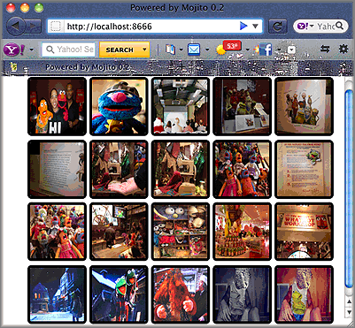

========================
Calling YQL from a Mojit
========================

**Time Estimate:** 15 minutes

**Difficulty Level:** Intermediate

Summary
#######

This example shows how to use YQL to get Flickr images from a Mojito application. YQL allows you to get data from many sources in the form of JSON, JSONP, and XML. 
For more information about YQL, see the `YQL Guide <http://developer.yahoo.com/yql/guide/>`_. For this example, you will need to `get a Flickr API key <http://www.flickr.com/services/api/keys/apply/>`_.

The following topics will be covered:

- forming a YQL statement to get Flickr photo information
- creating a model for your mojit to get data
- getting query string parameters with the ``Params`` addon
- calling the YQL Web service with the `YQL Module of YUI <http://developer.yahoo.com/yui/3/yql/>`_

Implementation Notes
####################

The following screenshot shows the grid of Flickr images retrieved by YQL.

Forming the YQL Statement and Flickr Photo URI
==============================================

The mojit model needs a method to access data. This code example uses YQL to access Flickr data, so we need to form the YQL statement to get the Flickr image information. Because the response from 
the YQL statement contains photo information and not the URIs to images, you also need to form the URI scheme for Flickr photos.

To get photo data from Flickr, you use the YQL table ``flickr.photos.search``. This table allows you to get photos that are associated with a string. In the YQL statement below, we use the table to 
return Flickr photos whose title, description, or tags contain the text "muppet". Click on the YQL statement to open the YQL Console, and then click the **TEST** button to see the returned XML response.

`select * from flickr.photos.search where text="muppets" and api_key="9cc79c8bf1942c683b0d4e30b838ee9c" <http://developer.yahoo.com/yql/console/#h=select%20*%20from%20flickr.photos.search%20where%20has_geo%3D%22true%22%20and%20text%3D%22san%20francisco%22%20and%20api_key%3D%229cc79c8bf1942c683b0d4e30b838ee9c%22>`_

As you can see from the partial response from YQL below, the photo URIs are not returned, just metadata about the photos. You need to extract metadata and use it to form the 
photo URIs to get the photos. We'll look at the URI scheme for the photos next.

.. code-block:: xml

   <?xml version="1.0" encoding="UTF-8"?>
   <query xmlns:yahoo="http://www.yahooapis.com/v1/base.rng"  yahoo:count="10" yahoo:created="2011-04-11T18:06:11Z" yahoo:lang="en-US">
     <results>
       <photo farm="6" id="5610093730" isfamily="0" isfriend="0" ispublic="1" owner="39177028@N02" secret="9d63f1859f" server="5022" title="Bert - Brighton Marathon 2011"/>
       <photo farm="6" id="5610093952" isfamily="0" isfriend="0" ispublic="1" owner="39177028@N02" secret="fded96fba7" server="5181" title="Bert - Brighton Marathon 2011"/>
       ...
     </results>
   </query>

Using the ``farm``, ``server``, ``id``, ``secret``, and ``title`` attributes from the response, you form the photo URIs using the following URI scheme:

``http://farm + {farm} + static.flickr.com/ + {server} + / + {id} + _ + {secret} + .jpg``

Having formed the YQL statement and the Flickr photo URI to get data, we can create the model.

Creating the Model
==================

The mojit model for this code example does the following:

- creates the YQL statement
- calls the YQL Web service
- extracts the data from the returned response
- forms the photo URIs
- passes photo information to the controller

In the example ``model.server.js`` below, the ``search`` function creates the YQL statement and passes it to the ``YQL`` function made available by the `YQL Module of YUI <http://developer.yahoo.com/yui/3/yql/>`_.

The ``YQL`` function makes the REST call to the YQL Web services, and the response is passed to an anonymous function. This function extracts the fields from the response that are needed to 
create the photo URIs and then stores those photo URIs, photo IDs, and titles in objects. These objects are stored in the ``photos`` array and passed to the controller through the ``callback`` function.

.. code-block: javascript

   YUI.add('flickrModel', function(Y,NAME) {
     // Flickr requires an API key
     var API_KEY = '9cc79c8bf1942c683b0d4e30b838ee9c';
     Y.mojito.models.flickr = {
       init: function(config) {
         this.config = config;
       },
       getData: function(callback) {
         callback({some:'data'});
       },
       // Search for Flickr Images
       search: function (search, start, count, callback) {
         // Handle empty.
         if (null == search || 0 == search.length) {
           callback([]);
         }
         // Build YQL select.
         start /= 1; count /= 1;
         var select = 'select * from '+ 'flickr.photos.search ' + '(' + (start || 0) + ',' + (count || 20) + ') ' + 'where '+ 'text="%' + (search || 'muppet') + '%" and api_key="' + API_KEY + '"';
         // Execute against YQL
         Y.YQL (select, function(rawYql) {
         // Handle empty response.
           if (null == rawYql || 0 == rawYql.query.count) {
             callback ([]);
           }
           // Process data.
           var photos = [], item = null;
           // Force array.
           if ( !rawYql.query.results.photo.length ) {
             rawYql.query.results.photo = [
               rawYql.query.results.photo
             ];
           }
           // Assume array
           for (var i=0; i < rawYql.query.count; i++) {
             // Fix up the item.
             item = rawYql.query.results.photo[i];
             item.url = 'http://farm' + item.farm + '.static.flickr.com/' + item.server + '/' + item.id + '_' + item.secret + '.jpg';
             item.title = (!item.title) ? search + ':' + i : item.title;
             // Attach the result.
             photos.push (
               {
                 id: item.id,
                 title: item.title,
                 url: item.url
               }
             );
           }
           callback (photos);
         });
       }
     };
   }, '0.0.1', {requires: ['yql']});

.. note:: If you are new to the Node.js world, when you create models for your applications, take these words to heart: **DON'T WRITE BLOCKING CODE**. Models need to be asynchronous in order to allow the rest of Mojito execution to continue, so you cannot call any model functions synchronously. You must call them with a callback function to be executed when the model receives its data. Because you don't know when the model is getting its data, you have to assume that it may block.

Calling the Model from the Controller
=====================================

The controller in this code example performs the following functions:

- gets the query string parameters using the `Params addon <../../api/classes/Params.common.html>`_
- passes the query string parameters to the ``search`` function of the model
- receives the ``photos`` array from the ``search`` function and sends an object to the view template

The ``index`` function in the ``controller.server.js`` below uses the ``getFromUrl`` method of the ``Params`` addon to get the query string parameters to form the YQL statement. The YQL Statement and 
the `paging and limit parameters <http://developer.yahoo.com/yql/guide/paging.html>`_ are then passed to the ``search`` function of the model.

To access model functions from the controller, you use the Action Context (``ac``) object with the following syntax: ``ac.models.{model_name}``. This code example uses the ``flickr`` mojit, so to 
access the model from the controller, you would use ``ac.models.flickr`` as seen in the ``model.server.js`` below. Once the callback function passed to ``search`` returns the array of photo objects, 
the ``done`` method sends the ``photos`` array and the query string parameters to the ``index`` view template.

.. code-block:: javascript

   YUI.add('flickr', function(Y,NAME) {
     Y.mojito.controllers[NAME] = {
       init: function(config) {
         this.config = config;
       },
       index: function(ac) {
         var q = ac.params.getFromUrl('q') || 'muppet',
         page = (ac.params.getFromUrl('page') || 0) / 1,
         count = (ac.params.getFromUrl('size') || 20) / 1,
         start = page * count;
         var model = ac.models.flickr;
         model.search (q, start, count, function(photos) {
         ac.done (
           {
             photos: photos,
             page: page,
             count: count,
             start: start
           });
         });
       }
     };
   }, '0.0.1', {requires: []});

Setting Up this Example
#######################

To set up and run ``model_yql``:

#. Create your application.

   ``$ mojito create app model_yql``

#. Change to the application directory.

#. Create your mojit.

   ``$ mojito create mojit flickr``

#. To specify that your application uses ``HTMLFrameMojit`` and the child ``flickr`` mojit, replace the code in ``application.json`` with the following:

   .. code-block:: javascript

      [
        {
          "settings": [ "master" ],
          "specs": {
            "frame": {
              "type": "HTMLFrameMojit",
              "config": {
                "deploy": true,
                "child": {
                  "type": "flickr"
                },
                "assets": {
                  "top": {
                    "css": [
                      "/static/flickr/assets/index.css"
                    ]
                   }
                 }
              }
            }
          }
        }
      ]

#. To configure the routing to call the ``index`` method an instance of ``HTMLFrameMojit``, create the file ``routes.json`` with the following:

   .. code-block:: javascript

      [
        {
          "settings": [ "master" ],
          "_index": {
            "verbs": ["get"],
            "path": "/",
            "call": "frame.index"
          }
        }
      ]

#. Change to ``mojits/flickr``.

#. Modify the mojit model to call YQL to get Flickr photos by replacing the code in ``models/model.server.js`` with the following:

   .. code-block:: javascript

      YUI.add('flickrModel', function(Y,NAME) {
        // Replace '{Flickr API Key}' with your own Flickr
        // API key.
        var API_KEY = '{Flickr API Key}';
        Y.mojito.models.flickr = {
          init: function(config) {
            this.config = config;
          },
          getData: function(callback) {
            callback({some:'data'});
          },
          // Search for Flickr Images
          search: function (search, start, count, callback) {
            // Handle empty.
            if (null == search || 0 == search.length) {
              callback([]);
            }
            // Build YQL select.
            start /= 1; count /= 1;
            var select = 'select * from '+ 'flickr.photos.search ' + '(' + (start || 0) + ',' + (count || 20) + ') ' + 'where '+ 'text="%' + (search || 'muppet') + '%" and api_key="' + API_KEY + '"';
            // Execute against YQL
            Y.YQL (select, function(rawYql) {
              // Handle empty response.
              if (null == rawYql || 0 == rawYql.query.count) {
                callback ([]);
              }
              // Process data.
              var photos = [], item = null;
              // Force array.
              if ( !rawYql.query.results.photo.length ) {
                rawYql.query.results.photo = [
                  rawYql.query.results.photo
                ];
              }
              // Assume array
              for (var i=0; i < rawYql.query.count; i++) {
                // Fix up the item.
                item = rawYql.query.results.photo[i];
                item.url = 'http://farm' + item.farm + '.static.flickr.com/' + item.server + '/' + item.id + '_' + item.secret + '.jpg';
                item.title = (!item.title) ? search + ':' + i : item.title;
                // Attach the result.
                photos.push (
                  {
                    id: item.id,
                    title: item.title,
                    url: item.url
                  }
                );
              }
              callback (photos);
            });
          }
        };
      }, '0.0.1', {requires: ['yql']});

#. `Get a Flickr API key <http://www.flickr.com/services/api/keys/apply/>`_ and then replace the string ``'{Flickr API Key}'`` in your model with your API key.

   .. code-block:: javascript

      YUI.add('flickrModel', function(Y,NAME) {
        // Replace '{Flickr API Key}' with your own Flickr
        // API key.
        var API_KEY = '{Flickr API Key}';
        ...
      }

#. Modify the mojit controller to get data from the model by replacing the code in ``controller.server.js`` with the following:

#. Create the file ``assets/index.css`` for the application's CSS with the following:

   .. code-block:: css

      body {
        margin:0;
        padding:0;
      }
      .tile li {
        display:inline;
        border-style: none;
        margin:0;
        padding:0;
      }
      .tile img {
        height:80px;
        width:80px;
      }
      .tile a img {
        border:4px solid;
        -webkit-border-radius:6px;
        -moz-border-radius:6px;
        border-radius:6px;
        border-color:#000;
      }

#. Modify your ``index`` view template by replacing the code in ``views/index.hb.html`` with the following:

   .. code-block:: html

      

        <ul class="tile">
        {{#photos}}
          <li></li>
        {{/photos}}
        </ul>
      

#. From the application directory, run the server.

   ``$ mojito start``

#. To view your application, go to the URL below:

   http://localhost:8666

#. Get 50 Flickr photos using the search query "mojito" with the following URL:

   http://localhost:8666?q=mojito&size=50

Source Code
###########

- `Mojit Model <http://github.com/yahoo/mojito/tree/master/examples/developer-guide/model_yql/mojits/flickr/models/model.server.js>`_
- `Mojit Controller <http://github.com/yahoo/mojito/tree/master/examples/developer-guide/model_yql/mojits/flickr/controller.server.js>`_
- `Flickr Application <http://github.com/yahoo/mojito/tree/master/examples/developer-guide/model_yql/>`_

