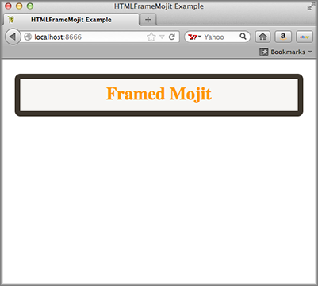

==========================
Using the HTML Frame Mojit
==========================

**Time Estimate:** 15 minutes

**Difficulty Level:** Intermediate

Summary
#######

This example shows how to use the HTML Frame Mojit ( ``HTMLFrameMojit``) to create the skeleton of an HTML page and embed rendered view template into the page. The ``HTMLFrameMojit`` creates 
the ``<html>``, ``<head>``, and ``<body>`` tags and embeds the rendered view templates of the child mojits into the ``<body>`` tag. To be clear, although the name ``HTMLFrameMojit`` contains 
the string "frame", the ``HTMLFrameMojit`` does **not** create HTML ``frame`` or ``iframe`` elements. This example only uses one child mojit, but you can configure the application to use many child mojits. 
For more information, see `HTMLFrameMojit <../topics/mojito_framework_mojits.html#htmlframemojit>`_.

The following topics will be covered:

- creating the framework for an HTML page
- embedding a rendered child mojit's view templates into the HTML page

Implementation Notes
####################

The screenshot below shows the page served by your application, where the visible content is created by the child mojit of ``HTMLFrameMojit``.

Tab 2 Selected

The ``HTMLFrameMojit`` is a reusable component that is available in every Mojito application. To configure the ``HTMLFrameMojit``, you use the ``application.json`` file. In this example ``application.json``, 
the ``frame`` object has a ``type`` property that specifies that ``HTMLFrameMojit`` create the HTML framework and embed the rendered view from the ``child`` mojit.

.. code-block:: javascript

   [
     {
       "settings": [ "master" ],
       "specs": {
         "frame" : {
           "type" : "HTMLFrameMojit",
           "config": {
             "title": "HTMLFrameMojit Example",
             "child" : {
               "type" : "framed"
             }
           }
         }
       }
     }
   ]

The Mojito server returns the HTML below to the client. The ``HTMLFrameMojit`` is responsible for the tags that comprise the skeleton of the HTML page and inserting the value of the ``title`` property
in ``application.json`` into the ``<title>`` element, and the child mojit creates the content that is embedded in the ``<body>`` tag. In this example, the child mojit creates the ``
`` tag and 
its content.

.. code-block:: html

   <!DOCTYPE HTML>
     <html>
       <head>
         <meta name="creator" content="Yahoo! Mojito 0.0.1">
         <title>HTMLFrameMojit Example</title>
       </head>
       <body>
         

         <h2 style="
           border-style: solid;
           border-width: 10px;
           border-color: #3D362D;
           -webkit-border-radius: 10px;
           -moz-border-radius: 10px;
           border-radius: 10px;
           margin-left: auto;
           margin-right: auto;
           padding: 10px 0px;
           background-color: #F7F6F4;
           text-align: center;
           font-weight: bold;
           font-size:2.0em;
           color: #FF9900;
           width: 90%;
         ">Framed Mojit</h2>
       

     </body>
   </html>

The ``HTMLFrameMojit`` mojit can be used to allow dynamic run-time selection of running on the client or server. You can also use ``HTMLFrameMojit`` to include assets and control 
language defaults.  These subjects are discussed in `Internationalizing Your Application <i18n_apps.html>`_.

Setting Up this Example
#######################

To set up and run ``htmlframe_mojit``:

#. Create your application.

   ``$ mojito create app htmlframe_mojit``

#. Change to the application directory.

#. Create your mojit.

   ``$ mojito create mojit framed``

#. To configure the application to use the ``HTMLFrameMojit``, replace the code in ``application.json`` with the following:

   .. code-block:: javascript

     [
       {
         "settings": [ "master" ],
         "specs": {
           "frame" : {
             "type" : "HTMLFrameMojit",
             "config": {
               "title": "HTMLFrameMojit Example",
               "child" : {
                 "type" : "framed"
               }
             }
           }
         }
       }
     ]

#. To configure routing, create the file ``routes.json`` with the following:

   .. code-block:: javascript

      [
        {
          "settings": [ "master" ],
          "_framed_view": {
            "verbs": ["get"],
            "path": "/",
            "call": "frame.index"
            }
        }
      ]

#. Change to ``mojits/framed``.

#. Modify the controller of the ``framed`` mojit by replacing the code in ``controller.server.js`` with the following:

   .. code-block:: javascript

      YUI.add('framed', function(Y,NAME) {
        Y.mojito.controllers[NAME] = {
          init: function(config) {
            this.config = config;
          },
          index: function(ac) {
            ac.done({app_name:'Framed Mojit'});
          }
        };
      }, '0.0.1', {requires: ['mojito']});

#. Modify the default view template by replacing the code in ``views/index.hb.html`` with the following:

   .. code-block:: html

      

        <h2 style="
          border-style: solid;
          border-width: 10px;
          border-color: #3D362D;
          -webkit-border-radius: 10px;
          -moz-border-radius: 10px;
          border-radius: 10px;
          margin-left: auto;
          margin-right: auto;
          padding: 10px 0px;
          background-color: #F7F6F4;
          text-align: center;
          font-weight: bold;
          font-size:2.0em;
          color: #FF9900;
          width: 90%;
        ">{{app_name}}</h2>
      

The HTML fragment in the view template above will be embedded in the ``<body>`` tag by ``HTMLFrameMojit``.

#. From the application directory, run the server.

   ``$ mojito start``

#. To view your application, go to the URL:

   http://localhost:8666

Source Code
###########

- `Application Configuration <http://github.com/yahoo/mojito/tree/master/examples/developer-guide/htmlframe_mojit/application.json>`_
- `HTML Frame Application <http://github.com/yahoo/mojito/tree/master/examples/developer-guide/htmlframe_mojit/>`_

