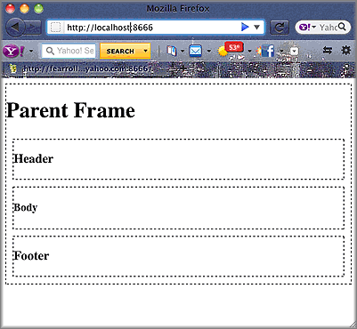

=====================
Using Multiple Mojits
=====================

**Time Estimate:** 15 minutes

**Difficulty Level:** Intermediate

Summary
#######

This example shows how to use a parent mojit with multiple child mojits to create an HTML page.

The following topics will be covered:

- configuring the application to use multiple mojits
- including the output from different mojits in one view template
- embedding the rendered view template into the HTML frame

.. tip:: To learn how to use the Mojito built-in mojit ``HTMLFrameMojit`` to aggregate and display the output from child mojits, see `Using the HTML Frame Mojit <./htmlframe_view.html>`_.

Implementation Notes
####################

In the screenshot below, you see an HTML page divided into header, body, and footer sections that were created by individual mojits.

In the ``application.json`` below that is used for this code example, you see that this application is using the ``frame`` instance of type ``FrameMojit``. 
The ``FrameMojit`` forms a skeleton page of ``div`` tags that use content created by the child mojits ``HeaderMojit``, ``BodyMojit``, and ``FooterMojit``.

.. code-block:: javascript

   [
     {
       "settings": [ "master" ],
       "appPort": 8666,
       "specs": {
         "parent": {
           "type": "FrameMojit",
           "config" : {
             "children": {
               "header": {
                 "type": "HeaderMojit"
               },
               "body": {
                 "type": "BodyMojit"
               },
               "footer": {
                 "type": "FooterMojit"
               }
             }
           }
         }
       }
     }
   ]

In ``routes.json``, the path set for each mojit is different, but the ``index`` function from each mojit is called when GET calls are made. What's not obvious here is how the ``frame`` mojit 
gets output from the other mojits because that happens in the controller of the ``frame`` mojit and not in the route configuration.

.. code-block:: javascript

   [
     {
       "settings": ["master"],
       "root": {
         "verbs": ["get"],
         "path": "/",
         "call": "frame.index"
       },
       "header": {
         "verbs": ["get"],
         "path": "/header",
         "call": "header.index"
       },
       "body": {
         "verbs": ["get"],
         "path": "/body",
         "call": "body.index"
       },
       "footer": {
         "verbs": ["get"],
         "path": "/footer",
         "call": "footer.index"
       }
     }
   ]

In ``controller.server.js`` of the ``FrameMojit``, the ``Composite`` addon allows the parent mojit to execute the child mojits defined in ``application.json`` that we looked at earlier. 
After the children mojits are executed, the data that is passed to the ``done`` method in the children mojits becomes accessible in the ``index.hb.html`` view template of ``FrameMojit``, 
which we will take a look at next.

.. code-block:: javascript

   YUI.add('FrameMojit', function(Y,NAME) {
     Y.mojito.controllers[NAME] = {
       init: function(config) {
         this.config = config;
       },
       index: function(actionContext) {
           actionContext.composite.done({template: {title: "Parent Frame"}});
         }
       };
     }
   }, '0.0.1', {requires: []});

The ``index.hb.html`` view template of ``FrameMojit``, shown below, has variables from the children mojits in different ``div`` tags. The variables ``header``, ``body``, and ``footer`` are in triple braces, 
which allows you to return unescaped HTML.

.. code-block:: html

   

     <h1>{{title}}</h1>
     

       {{{header}}}
     

     

       {{{body}}}
     

     

       {{{footer}}}
     

   

Setting Up this Example
#######################

To set up and run ``multiple_mojits``:

#. Create your application.

   ``$ mojito create app multiple_mojits``

#. Change to the application directory.

#. Create the mojits for the HTML frame, body, header, and footer.

   ``$ mojito create mojit FrameMojit``

   ``$ mojito create mojit BodyMojit``

   ``$ mojito create mojit HeaderMojit``

   ``$ mojito create mojit FooterMojit``

#. To configure your application to use the mojits you created, replace the code in ``application.json`` with the following:

   .. code-block:: javascript

      [
        {
          "settings": [ "master" ],
          "specs": {
            "frame": {
              "type": "FrameMojit",
              "config": {
                "children": {
                  "header": {
                    "type": "HeaderMojit"
                  },
                  "body": {
                    "type": "BodyMojit"
                  },
                  "footer": {
                    "type": "FooterMojit"
                  }
                }
              }
            }
          }
        }
      ]

#. To configure routing, create the file ``routes.json`` with the following:

   .. code-block:: javascript

      [
        {
          "settings": ["master"],
          "root": {
            "verbs": ["get"],
            "path": "/",
            "call": "frame.index"
          },
          "header": {
            "verbs": ["get"],
            "path": "/header",
            "call": "header.index"
          },
          "body": {
            "verbs": ["get"],
            "path": "/body",
            "call": "body.index"
          },
          "footer": {
            "verbs": ["get"],
            "path": "/footer",
            "call": "footer.index"
          }
        }
      ]

#. Change to ``mojits/FrameMojit``.

#. To allow the ``FrameMojit`` to execute its child mojits, replace the code in ``controller.server.js`` with the following:

   .. code-block:: javascript

      YUI.add('FrameMojit', function(Y,NAME) {
        Y.mojito.controllers[NAME] = {
          init: function(config) {
            this.config = config;
          },
          index: function(actionContext) {
              actionContext.composite.done({template: {title: "Parent Frame"}});
          }
        };
      }, '0.0.1', {requires: []});

#. Modify the default template to use Handlebars expressions from the child mojits by replacing the code in ``views/index.hb.html`` with the following:

   .. code-block:: javascript

      

        <h1>{{title}}</h1>
        

          {{{header}}}
        

        

          {{{body}}}
        

        

          {{{footer}}}
        

      

#. Change to ``HeaderMojit`` directory.

   ``$ cd ../HeaderMojit``

#. Replace the code in ``controller.server.js`` with the following:

   .. code-block:: javascript

      YUI.add('HeaderMojit', function(Y,NAME) {
        Y.mojito.controllers[NAME] = {
          init: function(config) {
            this.config = config;
          },
          index: function(actionContext) {
            actionContext.done({title: "Header"});
          }
        };
      }, '0.0.1', {requires: []});

   The ``done`` method will make its parameters available to the view template.

#. Replace the code in ``views/index.hb.html`` with the following:

   .. code-block:: html

      

        <h3>{{title}}</h3>
      

   This HTML fragment will be included in the header section of the default view template of ``FrameMojit``.

#. Change to ``BodyMojit`` directory.

   ``$ cd ../BodyMojit``

#. Replace the code in ``controller.server.js`` with the following:

   .. code-block:: javascript

      YUI.add('BodyMojit', function(Y,NAME) {
        Y.mojito.controllers[NAME] = {
          init: function(config) {
            this.config = config;
          },
          index: function(actionContext) {
            actionContext.done({title: "Body"});
          }
        };
      }, '0.0.1', {requires: []});

#. Replace the code in ``views/index.hb.html`` with the following:

   .. code-block:: html

      

        <h4>{{title}}</h4>
      

   This HTML fragment will be included in the body section of the default view template of ``FrameMojit``.

#. Change to the ``FooterMojit`` directory.

   ``$ cd ../FooterMojit``

#. Replace the code in ``controller.server.js`` with the following:

   .. code-block:: javascript

      YUI.add('FooterMojit', function(Y,NAME) {
        Y.mojito.controllers[NAME] = {
          init: function(config) {
            this.config = config;
          },
          index: function(actionContext) {
            actionContext.done({title: "Footer"});
          }
        };
      }, '0.0.1', {requires: ['mojito']});

#. Replace the code in ``views/index.hb.html`` with the following:

   .. code-block:: html

      

        <h3>{{title}}</h3>
      

   This HTML fragment will be included in the footer section of the default view template of ``FrameMojit``.

#. From the application directory, run the server.

   ``$ mojito start``

#. To view your application, go to the URL:

   http://localhost:8666

Source Code
###########

- `Application Configuration <http://github.com/yahoo/mojito/tree/master/examples/developer-guide/multiple_mojits/application.json>`_
- `Multiple Mojit Application <http://github.com/yahoo/mojito/tree/master/examples/developer-guide/multiple_mojits/>`_

