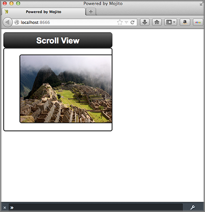

==============================
Including YUI Modules in Views
==============================

**Time Estimate:** 15 minutes

**Difficulty Level:** Intermediate

Summary
#######

This example shows how to include the `YUI ScrollView Module <http://developer.yahoo.com/yui/3/scrollview/>`_ in your mojit's view template.

The following topics will be covered:

- embedding the YUI ScrollView Module in the view template
- implementing a scrolling content widget

Implementation Notes
####################

The following screenshots show you how the application appears on different devices.

In the ``application.json`` file for this code example, the customized CSS are specified in the ``assets`` array as seen below.

.. code-block:: javascript

   [
     {
       "settings": [ "master" ],
       "specs": {
         "frame" : {
           "type" : "HTMLFrameMojit",
           "config": {
             "deploy": true,
             "child" : {
               "type" : "scroll"
             },
             "assets": {
               "top": {
                 "css":[
                   "/static/scroll/assets/index.css"
                 ]
               }
             }
           }
         }
       }
     }
   ]

The mojit controller provides the photo URLs for the scrollable content widget. In the ``controller.server.js`` below, the ``photos`` array that contains the photo URLs and the text for the 
image ``alt`` attribute is passed to the ``index`` view template.

.. code-block:: javascript

   YUI.add('scroll', function(Y,NAME) {
       Y.mojito.controllers[NAME] = {
         init: function(config) {
           this.config = config;
       },
       index: function(ac) {
         // Populate Template
         ac.done({
           title: 'Scroll View',
           photos: [
             {
               url: 'http://farm5.static.flickr.com/4136/4802088086_c621e0b501.jpg',
               alt: 'Above The City II'
             },
             {
               url: 'http://farm5.static.flickr.com/4114/4801461321_1373a0ef89.jpg',
               alt: 'Walls and Canyon'
             },
             {
               url: 'http://farm5.static.flickr.com/4100/4801614015_4303e8eaea.jpg',
               alt: 'Stairs Using In Situ Stone'
             },
             {
               url: 'http://farm5.static.flickr.com/4076/4801368583_854e8c0ef3.jpg',
               alt: 'Tree Silhouette'
             }
           ]
         });
       }
     };
   }, '0.0.1', {requires: ['mojito']});

In the ``index.hb.html`` below, the YUI ScrollView module is included with ``YUI.use``. To create the scrolling content widget,  you need to create a container, a header, and content frame with ``div`` tags 
that use YUI-specific IDs and render a ScrollView object. For detailed instructions, see the `Getting Started <http://developer.yahoo.com/yui/3/scrollview/#start>`_ section on the YUI 3: ScrollView page.

.. code-block:: html

   
   

     

       

         <h1>{{title}}</h1>
       

       

         <ul>
         {{#photos}}
           <li></li>
         {{/photos}}
         </ul>
       

     

   

   

Setting Up this Example
#######################

To set up and run ``scroll_views``:

#. Create your application.

   ``$ mojito create app scroll_views``

#. Change to the application directory.

#. Create your mojit.

   ``$ mojito create mojit scroll``

#. To configure you application, replace the code in ``application.json`` with the following:

   .. code-block:: javascript

      [
        {
          "settings": [ "master" ],
          "specs": {
            "frame" : {
              "type" : "HTMLFrameMojit",
              "config": {
                "deploy": true,
                "child" : {
                "type" : "scroll"
                },
                "assets": {
                  "top": {
                    "css":[
                      "/static/scroll/assets/index.css"
                    ]
                  }
                }
              }
            }
          }
        }
      ]

#. To configure routing to call the ``index`` action from the instance of the ``HTMLFrameMojit`` when an HTTP GET call is made on the route path, create the file ``routes.json`` with the following:

   .. code-block:: javascript

      [
        {
          "settings": [ "master" ],
          "_index": {
            "verbs": ["get"],
            "path": "/",
            "call": "frame.index"
          }
        }
      ]

#. Change to ``mojits/scroll``.

#. To have the controller send image data to the view template for the scrolling widget, replace the code in ``controller.server.js`` with the following:

   .. code-block:: javascript

      YUI.add('scroll', function(Y,NAME) {
        Y.mojito.controllers[NAME] = {
          init: function(config) {
            this.config = config;
          },
          index: function(ac) {
            // Populate Template
            ac.done({
              title: 'Scroll View',
              photos: [
                {
                  url: 'http://farm5.static.flickr.com/4136/4802088086_c621e0b501.jpg',
                  alt: 'Above The City II'
                },
                {
                  url: 'http://farm5.static.flickr.com/4114/4801461321_1373a0ef89.jpg',
                  alt: 'Walls and Canyon'
                },
                {
                  url: 'http://farm5.static.flickr.com/4100/4801614015_4303e8eaea.jpg',
                  alt: 'Stairs Using In Situ Stone'
                },
                {
                  url: 'http://farm5.static.flickr.com/4076/4801368583_854e8c0ef3.jpg',
                  alt: 'Tree Silhouette'
                }
              ]
            });
          }
        };
      }, '0.0.1', {requires: []});

#. To modify the ``index`` view template, replace the code in ``views/index.hb.html`` with the following:

   .. code-block:: html

      
      

        

          

            <h1>{{title}}</h1>
          

          

            <ul>
            {{#photos}}
              <li></li>
            {{/photos}}
            </ul>
          

        

      

      

#. To add CSS for the ``index`` view template, create the file ``assets/index.css`` with the following:

   .. code-block:: css

      html, body {
        margin:0;
        padding:0;
        font-family: arial,helvetica,clean,sans-serif;
      }
      #scrollview {
        border:2px solid #000;
        -webkit-border-radius:6px;
        -moz-border-radius:6px;
        border-radius:6px;
      }
      #scrollview-content img {
        border:2px solid;
        -webkit-border-radius:6px;
        -moz-border-radius:6px;
        border-radius:6px;
        width: 300px;
        margin: 2px -1px 2px 6px;
        -webkit-transform: translate3d(0, 0, 0);
      }
      /* To layout horizontal LIs */
      #scrollview-content {
        white-space:nowrap;
      }
      #scrollview-content li {
        display:inline-block;
        background-color:#fff;
      }
      /* For IE 6/7 - needs inline block hack */
      #scrollview-content li {
        *display:inline;
        *zoom:1;
      }
      /* === scrollview container and header styles === */
      #scrollview-container {
        float:left;
        margin:10px;
      }
      #scrollview-header {
        height:44px;
        *width:320px;
        border: 1px solid #9c9c9c;
        /* Fallback style */
        border: 1px solid rgba(0, 0, 0, 0.3);
        -webkit-border-radius: .5em;
        -webkit-border-top-left-radius: .5em;
        -webkit-border-top-right-radius: .5em;
        -webkit-border-bottom-left-radius: .5em;
        -webkit-border-bottom-right-radius: .5em;
        -moz-border-radius: .5em;
        border-radius: .5em;
        background: #141414;
        background: -webkit-gradient(linear, left top, left bottom, from(#656565), to(#141414) );
        background: -moz-linear-gradient(-90deg, #656565, #141414);
        filter: progid:DXImageTransform.Microsoft.Gradient(GradientType=0, StartColorStr='#656565', EndColorStr='#141414');
      }
      #scrollview-header h1 {
        color: #fff;
        margin:0;
        padding:10px 0;
        text-align:center;
        font-size:150%;
        font-weight:bold;
        text-shadow: 0 -1px 0 rgba(0,0,0,0.7);    }
      #scrollview-pager {
        padding:5px;
      }

#. From the application directory, run the server.

   ``$ mojito start``

#. To view your application, go to the URL:

   http://localhost:8666

Source Code
###########

- `Index View Template <http://github.com/yahoo/mojito/tree/master/examples/developer-guide/scroll_views/mojits/scroll/views/index.hb.html>`_
- `Scroll Views Application <http://github.com/yahoo/mojito/tree/master/examples/developer-guide/scroll_views/>`_

