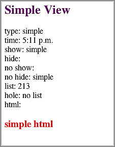

==============================================
Creating a Simple View with Mustache Templates
==============================================

**Time Estimate:** 10 minutes

**Difficulty Level:** Beginning

Summary
#######

This example shows how to create a simple view for Mojito applications with `Mustache templates <http://mustache.github.com/>`_. Mojito views are template files that are 
rendered into HTML and served to a device. These template files are simply called *view templates* in this example and throughout the Mojito documentation.

The following topics will be covered:

- adding a simple view template
- Mustache template basics
- passing data to the view template

Implementation Notes
####################

In the following screenshot, you see the HTML page that was rendered from the view template.

In Mojito applications, the controller is responsible for passing data to the view template. From the below code snippet taken from ``controller.server.js``, you see the ``index`` function 
creating a ``data`` object and passing it to the ``done`` method. The ``done`` method called on ``ac``, the `ActionContext <../../api/classes/ActionContext.html>`_ object, sends the ``data`` object to the view template ``index.mu.html``.

.. code-block:: javascript

   ...
     index: function(ac) {
       var today = new Date(),
         data = {
           type : 'simple',
           time : { hours: today.getHours()%12, minutes: today.getMinutes()<10 ? "0" + today.getMinutes() : today.getMinutes(), period: today.getHours()>=12 ? "p.m." : "a.m."},
           show : true,
           hide : false,
           list : [{id: 2}, {id: 1}, {id: 3}],
           hole : null,
           html : "<h3 style='color:red;'>simple html</h3>"
         };
         ac.done(data);
       }
     };
   ...

In the ``index`` view template of this code example, the properties of the ``data`` object are placed in Mustache tags that are evaluated by Mojito when the view template is rendered. 
In Mustache templates, the property names in double mustaches, such as ``{{type}}``, are variables.  The double mustaches with a pound are called sections and can be used for lists or 
conditional expression, such as ``{{#show}...{{/show}``. You also use double mustaches with a pound to access properties within an object, which is how the ``hours`` property of the ``time`` object 
is accessed here.

.. code-block:: html

   

     <h2 style="color: #606; font-weight:bold;">Simple View</h2>
     
type: {{type}}

     
time: {{#time}}{{hours}}:{{minutes}} {{period}}{{/time}}

     
show: {{#show}}{{type}}{{/show}}

     
hide: {{#hide}}{{type}}{{/hide}}

     
no show: {{^show}}{{type}}{{/show}}

     
no hide: {{^hide}}{{type}}{{/hide}}

     
list: {{#list}}{{id}}{{/list}}

     
hole: {{^hole}}no list{{/hole}}

     
html: {{{html}}}

   

For the complete list of Mustache tag types, see the `Mustache Manual <http://mustache.github.com/mustache.5.html>`_.

Setting Up This Example
#######################

To set up and run ``simple_view``:

#. Create your application.

   ``$ mojito create app simple_view``

#. Change to the application directory.

#. Create your mojit.

   ``$ mojito create mojit simple``

#. To specify that your application use the ``simple`` mojit, replace the code in ``application.json`` with the following:

   .. code-block:: javascript

      [
        {
          "settings": [ "master" ],
          "specs": {
            "simple" : {
              "type": "simple"
            }
          }
        }
      ]

#. To configure the routing for your application, create the file ``routes.json`` with the following:

   .. code-block:: javascript

      [
        {
          "settings": [ "master" ],
            "_simple_view": {
            "verbs": ["get"],
            "path": "/",
            "call": "simple.index"
          }
        }
      ]

#. Change to ``mojits/simple``.

#. Modify the mojit controller to pass data to the view by replacing the code in ``controller.server.js`` with the following:

   .. code-block:: javascript

      YUI.add('simple', function(Y, NAME) {
        Y.mojito.controllers[NAME] = {
          init: function(config) {
            this.config = config;
          },
          index: function(ac) {
            var today = new Date(),
            data = {
              type : 'simple',
              time : { hours: today.getHours()%12, minutes: today.getMinutes()<10 ? "0" + today.getMinutes() : today.getMinutes(), period: today.getHours()>=12 ? "p.m." : "a.m."},
              show : true,
              hide : false,
              list : [{id: 2}, {id: 1}, {id: 3} ],
              hole : null,
              html : "<h3 style='color:red;'>simple html</h3>"
            };
            ac.done(data);
          }
        };
      }, '0.0.1', {requires: []});

#. Modify your ``index`` view template by replacing the code in ``views/index.mu.html`` with the following:

   .. code-block:: html

      

        <h2 style="color: #606; font-weight:bold;">Simple View</h2>
        
type: {{type}}

        
time: {{#time}}{{hours}}:{{minutes}} {{period}}{{/time}}

        
show: {{#show}}{{type}}{{/show}}

        
hide: {{#hide}}{{type}}{{/hide}}

        
no show: {{^show}}{{type}}{{/show}}

        
no hide: {{^hide}}{{type}}{{/hide}}

        
list: {{#list}}{{id}}{{/list}}

        
hole: {{^hole}}no list{{/hole}}

        
html: {{{html}}}

      

#. From the application directory, run the server.

   ``$ mojito start``

#. To view your application, go to the URL below:

   http://localhost:8666

Source Code
###########

- `Mojit Controller <http://github.com/yahoo/mojito/tree/master/examples/developer-guide/simple_view/mojits/simple/controller.server.js>`_
- `Simple View Application <http://github.com/yahoo/mojito/tree/master/examples/developer-guide/simple_view/>`_

