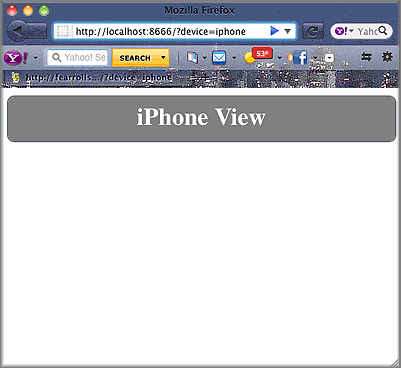
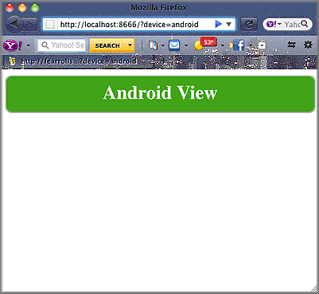
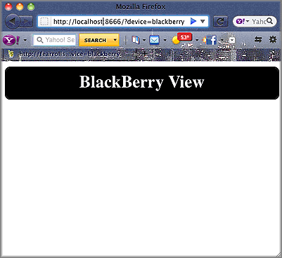

====================================
Creating Views for Different Devices
====================================

**Time Estimate:** 15 minutes

**Difficulty Level:** Intermediate

Summary
#######

This example shows how to create specialized views for different wireless devices, such as iPhones, BlackBerries, and Android phones. Each device uses different view templates but the 
same data from the controller.

The following topics will be covered:

- creating specialized views for wireless devices
- using query parameters to select the device view
- using the user agent to select the device view

Implementation Notes
####################

The following screenshots show you how the application appears on different devices.

For each device's customized view, you need to create a view template. This code example uses the view templates ``index.iphone.hb.html``, ``index.android.hb.html``, and ``index.blackberry.hb.html`` 
to create customized views for iPhones, Android phones, and BlackBerries. The ``hb`` in the view template file names represents the Handlebars rendering engine that renders Handlebars exressions.

Mojito uses two ways to determine what device is making an HTTP request for a page. The first way is to use the value assign to the query string parameter ``device``. For example, 
if Mojito received an HTTP GET request on the URL below, it would render the iPhone view into HTML and serve the page to the device.

::

   http://localhost:8666?device=iphone

Mojito also uses the HTTP User-Agent header field to decide which view to render and serve. In this example HTTP header, the User-Agent field indicates that the HTTP request is coming from an Android device, 
so Mojito would use the Android view template and serve the rendered HTML to the device.

::

   Host: learnto.mobi
   Accept-Encoding: gzip
   Referer: http://learnto.mobi/
   Accept-Language: en-US
   User-Agent: Mozilla/5.0 (Linux; U; Android 2.2; en-us; PC36100 Build/FRF91) AppleWebKit/533.1 (KHTML, like Gecko) Version/4.0 Mobile Safari/533.1
   Accept: application/xml,application/xhtml+xml,text/html;q=0.9,text/plain;q=0.8,image/png,*/*;q=0.5
   Accept-Charset: utf-8, iso-8859-1, utf-16, *;q=0.7

How does Mojito know which view template file to use? Mojito determines which view template file to use based on a file naming convention. The naming convention has three parts based on the action and 
the device as shown here:

``{action}.{device}.{rendering_engine}.html``

Thus, if an iPhone was making an HTTP GET request on the index (action) file and the view template was being rendered by the Handlebars rendering engine, Mojito would use ``index.iphone.hb.html`` 
and serve the rendered view as HTML to the iPhone.

The view templates used in this code example use the controller to get the data for the Handlebars expression ``{{mojit_view_id}}``, but each view template uses customized CSS.

Setting Up this Example
#######################

To set up and run ``device_views``:

#. Create your application.

   ``$ mojito create app device_views``

#. Change to the application directory.

#. Create your mojit.

   ``$ mojito create mojit device``

#. To configure you application, replace the code in ``application.json`` with the following:

   .. code-block:: javascript

      [
        {
          "settings": [ "master" ],
          "specs": {
            "device" : {
              "type": "device"
            }
          }
        }
      ]

#. To configure routing, create the file ``routes.json`` with the following:

   .. code-block:: javascript

      [
        {
          "settings": [ "master" ],
          "_device_view": {
            "verb": ["get"],
            "path": "/",
            "call": "device.index"
          }
        }
      ]

#. Change to ``mojits/device``.

#. Replace the code in ``controller.server.js`` with the following:

   .. code-block:: javascript

      YUI.add('device', function(Y,NAME) {
        Y.mojito.controllers[NAME] = {
          init: function(config) {
            this.config = config;
          },
          /* Method corresponding to the 'index' action.
          *
          * @param ac {Object} The action context that
          * provides access to the Mojito API.
          */
          index: function(ac) {
            ac.done({title: 'Device Views'});
          }
        };
      }, '0.0.1', {requires: []});

#. To modify the default view template, replace the code in ``views/index.hb.html`` with the following:

   .. code-block:: html

      <html>
        <head>
          
        </head>
        <body>
          

            <h2>Default View</h2>
          

        </body>
      </html>

#. For the iPhone view, create the ``views/index.iphone.hb.html`` file with the following:
   
   .. code-block:: html
   
      <html>
        <head>
          
        </head>
        <body>
          

            <h2>iPhone View</h2>
          

        </body>
      </html>

#. For the Android view, create the ``views/index.android.hb.html`` file with the following:

   .. code-block:: html

      <html>
        <head>
          
        </head>
        <body>
          

            <h2>Android View</h2>
          

        </body>
      </html>

#. For the BlackBerry view, create the ``views/index.blackberry.hb.html`` file with the following:

   .. code-block:: html

      <html>
        <head>
          
        </head>
        <body>
          

             <h2>BlackBerry View</h2>
          

        </body>
      </html>

#. From the application directory, run the server.

   ``$ mojito start``

#. To view your application, go to the URL:

   http://localhost:8666

#. Request the iPhone view by adding query string parameter ``?device=iphone``:

   http://localhost:8666?device=iphone

Source Code
###########

- `View Templates <http://github.com/yahoo/mojito/tree/master/examples/developer-guide/device_views/mojits/device/views/>`_
- `Device Views Application <http://github.com/yahoo/mojito/tree/master/examples/developer-guide/device_views/>`_

