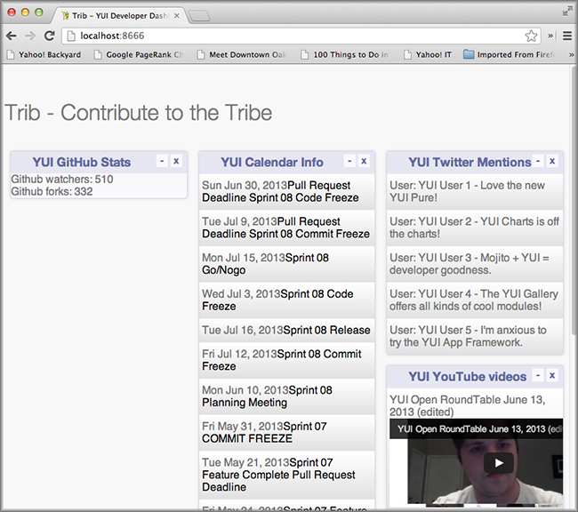

====================
6. Testing in Mojito
====================

.. _06_testing-intro:

Introduction
============

Our application has gotten complicated enough that we need to write some tests. 
We’re going to show you how to write unit and functional tests in this module, 
and we’re also going to add a few more mojits to fill out our dashboard. We 
already saw the Mojito CLI has a test command for running unit tests. To run 
functional tests, we’re going to use Arrow, which is an npm module that we’ll 
need to install.

.. _06_intro-what:

What We’ll Cover
----------------

- unit tests 
- model tests
- controller tests
- functional tests with Arrow

.. _06_intro-final:

Final Product
-------------

The main focus of this module is testing in Mojito, but as you can see from the 
screenshot, we’ve added some more mojits to flesh out the dashboard.

.. _06_intro-before_starting:

Before Starting
---------------

.. _06_intro-before_starting:

Review of the Last Module
#########################

We focused on getting data in the last module using YQL and the Mojito REST library.  
In Mojito applications, you want to use YQL whenever you can, and YUI makes it 
easier by having a YQL module. In certain cases, you may need to use the REST module 
because there is no YQL table available or because certain Web Services like Twitter 
set limitations on YQL making requests to the Twitter API.

We covered the following in the last module:

- mojit model
- YQL intro
- YQL statements
- YQL module
- REST module
- calling model from the controller

.. _06_intro-setting_up:

Setting Up
##########

#. ``$ cp -r 05_getting_data 06_testing``

#. Add the dependencies ``yahoo-arrow`` and ``phantomjs`` to ``package.json``, so that
   you can run functional tests. Arrow is the testing framework we'll be
   using for functional tests, and it relies on PhantomJS to simulate the
   browser environment.

   .. code-block:: javascript

      "optionalDependencies": {
        "simple-twitter": "~1.0.0",
         "yahoo-arrow": "~0.0.77",
         "phantomjs": ">=1.8.0"
      },

#. From the 06_testing directory, install the dependencies:
  
   ``$ npm install``

.. _06_testing-lesson:

Lesson: Testing
===============

.. _06_lesson-intro:

Introduction
------------

Mojito uses YUITest for unit tests and relies on Arrow for functional tests. 
We’re going to cover unit tests in more detail, but also show you how to write 
a simple functional test with Arrow.

.. _06_lesson-unit:

Unit Tests
----------

.. _06_lesson_unit-location:

Location
########

For application tests, the tests should be in the following directory: ``{app_name}/tests``

For mojit tests, place the tests in the following directory: ``{app_name}/mojits/{mojit_name}/tests``

Model tests are placed in the ``/tests/models`` directory for both application and mojit 
tests. You can also have tests for YUI modules, but we won’t be writing tests for YUI 
modules in this module.

.. _06_lesson_unit-naming_convention:

File Name Convention
####################

For controller tests, the test file name has the following syntax: ``controller.{affinity}-tests.js``

For models, the test file name is slightly different: ``{model_name}.{affinity}.js``

If you remember, the ``Twitter`` had the ``model twitter.server.js``, so the test file 
for the model would be ``twitter.server-tests.js``. 

.. _06_lesson_unit-writing_tests:

Writing Tests
#############

As we mentioned in the introduction, unit tests in Mojito use the testing framework YUI Test. 
To use the testing framework, you require  ``'mojito-test'`` in your test files and the module 
name that is being tested. For example, in the code snippet below, the testing framework is 
included as well as the module that is being tested (``'Github'``).

``{ requires: [ 'mojito-test', 'Github' ] }``

.. _06_lesson_unit-components:

Test Components
###############

Before we look at the unit tests for Mojito, let’s take a look at the core components of 
YUI tests, so you’ll have a better understanding of how the Mojito tests work.

.. _06_lesson_components-suites:

Test Suites 
***********

Test suites are just a way of grouping test cases together for a module. 

Example: ``var suite = new YUITest.TestSuite('myMojit-tests');``

.. _06_lesson_components-cases:

Test Cases
**********

Test cases are methods designed to test a specific piece of functional code. The test methods 
are named as typical JavaScript methods or using a string describing what the method does, 
such as “test mojit” purpose.  Test cases use the ``setUp`` method before each and every test 
in the test case to set up objects or variables needed by the test methods. The ``tearDown`` 
method is run after each test is run to free up memory after the test is run. The methods 
themselves often use assertions to verify the validity of a particular action or function.

Example:

.. code-block:: javascript

   var test_case1 = new YUITest.TestCase({
     name: 'myMojit user tests',
     setUp: function() {
       controller = Y.mojito.controllers.myMojit;
     },
     tearDown: function() {
       controller = null;
     },
     'test mojit': function() {
        // Add test code/assertions here
     }
   });

.. _06_lesson_components-runners:

Test Runners
************

The test runner is a singleton object that simply runs all of the tests in test cases and 
suites, reporting back on passes and failures. Typically, you would call the run method in 
YUI tests, but Mojito calls run for you when running mojito test. 

Example: ``YUITest.TestRunner.add(suite);``

.. _06_lesson_components-assertions:

Assertions
**********

Assertions are methods that check the validity of a particular action or function. If the 
action or function is not valid, the assertion method throws an error that causes the test 
to fail. When all assertions pass within a test method, the test  is said to have passed. 
The YUI Test framework has assertion methods for testing equality, sameness, data types, 
special values, and forced failures. Please see the  YUI Assertion documentation for 
details.

Example:  

.. code-block:: javascript

   var A = YUITest.Assert;
   A.isNotNull(controller);

.. _06_lesson_components-mock_obj:

Mock Objects
************

Mock objects are used to eliminate test dependencies on other objects. In Mojito, you often 
create a mock version of the ``ActionContext`` object to test methods such as ``done``. 
The expect method allows you to set up expectations for the mock object that can later be
verified with the ``verify`` method. The example below helps illustrate how the two methods 
work together.

Example:

.. code-block:: javascript

   var ac = new Y.mojito.MockActionContext();
   ac.expect(
     {
       method: 'done',
       args: [YUITest.Mock.Value.Object],
       run: function(data) {
         YUITest.ObjectAssert.areEqual({ just: 'testing' });
       }
     }
   );
   ac.verify();

.. _06_lesson_unit-controller:

Controller Tests
################

Now that you have a basic understanding of YUI test, writing controller tests should be 
fairly easy. You’ll need to do one thing specific to Mojito and that is get the YUI module 
of the controller to test. You do this by requiring the YUI module name for the controller 
and then accessing the controller code with the following: ``Y.mojito.controller.{YUI_module_name}``

Thus, if we were going to test the controller with the register YUI module name ``myMojit``, 
we would have ``'myMojit'`` in the required array and assign ``Y.mojito.controller.myMojit`` 
to a variable in the test as shown below:

.. code-block:: javascript

   YUI.add('myMojit-tests', function(Y) {
     var suite = new YUITest.TestSuite('myMojit-tests'),
         controller = null,
         A = YUITest.Assert;

     suite.add(new YUITest.TestCase({

       name: 'myMojit user tests',
       setUp: function() {
         // Fetch the module for the controller
         controller = Y.mojito.controllers.myMojit;
       },
       ... 
     YUITest.TestRunner.add(suite);
     // Include the module as a dependency for the test
   }, '0.0.1', {requires: ['mojito-test', 'myMojit']});

.. _06_lesson_unit_controller-components:

Putting the Components Together
*******************************

You create a test suite with the name passed to the test 
module:

.. code-block:: javascript

   YUI.add('githubMojit-tests', function(Y, NAME) {
     var suite = new YUITest.TestSuite(NAME);

You add a test case to the suite with a ``setUp`` method that accesses the 
controller object and a ``tearDown`` method to remove the object from memory: 

.. code-block:: javascript

   ...
     suite.add(new YUITest.TestCase({
       name: 'Foo tests',
       setUp: function() {
         controller = Y.mojito.controllers.Foo;
       },
       tearDown: function() {
         controller = null;
       },
   ...

Now comes the tests within the test case. We use a human-readable name
for the test such as ``test mojit`` and then just test that the controller
exists, that it has a function called ``index`` and that data is returned as shown
in the example below.

.. code-block:: javascript

    ...
      ...
         'test mojit': function() {
           var ac, doneCalled = false;
           A.isNotNull(controller);
           A.isFunction(controller.index);
           ac = {
             done: function(data) {
             doneCalled = true;
             A.isUndefined(data);
           }
         };
         controller.index(ac);
         A.isTrue(doneCalled);
       }
     ...
   ...

Finally, you add the test suite to the runner:

.. code-block:: javascript

     YUITest.TestRunner.add(suite);

Don't forget to add ``mojito-test`` and the module you are
testing (YUI registered name for the controller) to the ``requires`` array:

.. code-block:: javascript

   }, '0.0.1', {requires: ['mojito-test', 'Foo']});

You can also add properties to the ``ac`` object to mimic the ``ActionContext``
addons such as ``assets`` and ``models`` as show below. Here we're also testing
the asset file that is returned, the data returned from ``ac.done`` and 
``ac.models.get``:

.. code-block:: javascript

   ...
     ...
       'test mojit': function () {
         var ac,
             modelData,
             assetsResults,
             doneResults;
         modelData = { x:'y' };
         ac = {
           assets: {
             addCss: function (css) {
               assetsResults = css;
             }
           },
           models: {
             get: function (modelName) {
               A.areEqual('githubMojitModelFoo', modelName, 'wrong model name');
               return {
                 getData: function (cb) {
                   cb(null, modelData);
                 }
               }
             }
           },
           done: function (data) {
             doneResults = data;
           }
         };
         A.isNotNull(controller);
         A.isfunction (controller.index);
         controller.index(ac);
         A.areSame('./index.css', assetsResults);
         A.isObject(doneResults);
         A.areSame('Mojito is working.', doneResults.status);
         A.isObject(doneResults.data);
         A.isTrue(doneResults.data.hasOwnProperty('x'));
         A.areEqual('y', doneResults.data['x']);
       }
     ...
   ...

.. _06_lesson_unit-model:

Model Tests
###########

The model tests have the same structure as controller tests with the exception of 
how you access the module. You use ``Y.mojito.models.{YUI module name}`` to access the 
model. Again, you also have to require ``mojito-test`` and the YUI registered module 
name for the model. The test suite, test cases, ``setUp``/``tearDown`` methods, and 
assertions all work in the same way. 

In the example model test that we’ll be creating later, the model with the registered 
YUI module name ``YoutubeMojitYQL`` is required and then accessed in the ``setUp`` method.

.. code-block:: javascript

   ...
     var suite = new YUITest.TestSuite(NAME),
         model = null,
         A = YUITest.Assert;
     suite.add(new YUITest.TestCase({
       name: "YoutubeModelYQL user tests",
       setUp: function (){
         model = Y.mojito.models.YoutubeModelYQL;
       },
       ...
     ...
   }, '0.0.1', {requires: ['mojito-test', 'YoutubeModelYQL']});

.. code-block:: javascript

   YUI.add('YoutubeModelYQL-tests', function (Y, NAME) {

     var suite = new YUITest.TestSuite(NAME),
         model = null,
         A = YUITest.Assert;
     suite.add(new YUITest.TestCase({
       name: "YoutubeModelYQL user tests",
       setUp: function (){
         model = Y.mojito.models.YoutubeModelYQL;
       },
       tearDown: function (){
         mode = null;
       },
       'test mojit model': function (){
         var called = false,
             cfg = { color: 'red' };
         A.isNotNull(model);
         A.isfunction (model.init);
         model.init(cfg);
         A.areSame(cfg, model.config);

         // Check getData function is there
         A.isfunction (model.getData);

       }
     }));
     YUITest.TestRunner.add(suite);
   }, '0.0.1', {requires: ['mojito-test', 'YoutubeModelYQL']});

.. _06_lesson_unit-run:

Running Unit Tests
##################

To run functional tests, you use the Mojito command-line Utility. The test command allows 
you to test all of the mojits of an application or specify a mojit. Mojito will test all of 
the unit tests in the tests directory. To test all the mojits in the application that we 
are going to create this module, you would use the following:

``$ mojito test app .``

To test our githubMojit, you would specify the mojit:

``$ mojito test mojit mojits/githubMojit``

.. _06_lesson-functional:

Functional Tests
----------------

You could say that a functional tests is any test that is not a unit test, but for 
simplicity and our intent, we’re calling functional tests those that test the UI or 
functionality of an application. So, if you want to test the DOM or DOM events, you’re 
going to write functional tests and use Arrow. 

.. _06_lesson_func-arrow:

Intro to Arrow
##############

Arrow is a testing framework that combines JavaScript, Node.js, and PhantomJS/Selenium. It 
attempts to make writing functional tests as easy as unit tests. In fact, you write the 
you can write both unit and functional tests using YUI Test as well, but Mojito already has 
a convenient test command for running unit tests, so we’re going to focus on Arrow functional tests. As 
this is not an Arrow guide, we’re only going to scratch the surface of using the Arrow 
testing framework. We’ll look at writing tests, running a test suite, and using the Arrow 
command. To learn more about Arrow, we highly recommend that you read the 
`Arrow documentation <https://github.com/yahoo/arrow>`_. 

.. _06_func-arrow-write:

Writing Arrow Tests
*******************

As we’ve already said, tests for Arrow are written using YUI Test. You pass in a configuration 
object to YUI, load the modules that your test needs with the ``use`` method, and then write the 
test in the same way as you wrote unit tests: create a test suite, add a test case, and add 
the test case to the runner. Like Mojito, Arrow will call the method run for you to run the 
tests. 

The main difference between the Mojito unit tests and Arrow tests is that Mojito unit tests 
register the module name (with the method ``add``), and Arrow tests just load modules. The 
added difference here is that we’re using Arrow for functional tests, so the tests themselves 
are using the DOM.

In the example test for the getting started example in Mojito, the test ``"test hello"`` 
uses an assertion to confirm that the text value of the ``<pre>`` element is ``"Hello World!"``.  
In the example test below, the configuration object passed to YUI and the modules that are 
loaded are used for most tests, although you may need to add configurations and load more 
modules for other tests.

.. code-block:: javascript

   ...
     YUI({
       useConsoleOutput: true,
       useBrowserConsole: true,
       logInclude: { TestRunner: true }
     }).use('node', 'node-event-simulate', 'test', 'console', function (Y) {

     var suite = new Y.Test.Suite("DeveloperGuide: hello");
     suite.add(new Y.Test.Case({
       "test hello": function() {
         Y.Assert.areEqual("Hello World!", Y.one('pre').get('innerHTML'));
       }
     }));
     Y.Test.Runner.add(suite);
   });

.. _06_func-arrow-descriptor:

Test Descriptors
****************

.. _06_arrow_descriptor-intro:

Intro
+++++

Test Descriptors are JSON configuration files that allow you to organize your tests into 
test suites.  You can also use test descriptors to control when and which tests execute 
at a given phase of your development cycle. 

.. _06_arrow_descriptor-config:

Configurations
++++++++++++++

Test descriptors have configurations for describing, organizing, and factoring the tests. 
You can configure the base URL , group tests, pass parameters, and specify the page 
to test as well as the JavaScript test to run. 

The example test descriptor written to run the ``hello`` test we looked at earlier shows 
most of the important configurations. The ``name`` property allows you to describe your test, 
the ``config`` object allows you to specify the base URL, application name, and path. The 
``dataprovider`` object is where your tests are contained. Each test, such as ``"hello"`` 
below, can be grouped and be passed parameters. The ``params`` object below specifies the 
test and the page. Notice the annotations ``$$`` are used to indicate variables. 

.. code-block:: javascript

   [
     {
       "settings": [ "master" ],
       "name" : "hello",
       "config" :{
         "baseUrl" : "http://localhost:8666",
         "application" : {
           "name":"hello",
           "path": "../../../examples/developer-guide/hello"
         }
       },
       "dataprovider" : {
         "hello" : {
           "group" : "developerguide,hello",
           "params" : {
             "test" : "test_hello.js",
             "page" : "$$config.baseUrl$$/"
           }
         }
       }
     }
   ]

Many of the configurations in the test descriptor files can be passed (and overridden) 
from the command line. For example, the ``baseUrl`` property in the ``config`` object can 
be specified on the command line: 

``$  arrow <some test or test descriptor> --baseUrl=http://some.base.url.com``

.. _06_arrow_descriptor-create:

When to Create Test Descriptors
+++++++++++++++++++++++++++++++

Before creating test descriptors, we recommend executing each test with the Arrow 
command. Once you have a set of working tests, you should organize and factor 
the tests with a test descriptor. During test development, you’ll probably 
execute each test from the Arrow command line. However, once you have created 
tests to validate your module, you need a way to organize and factorize the tests.

.. _06_arrow_descriptor-context:

Tests Based on Contexts
+++++++++++++++++++++++

You can also configure tests based on contexts, so you could run a set of tests 
for the development environment and run a different set of tests for the production 
environment.  The contexts in the text descriptors are like those in the configuration 
files for Mojito applications. In the example test descriptor below, you can see 
that given the context ``"environment:development"``, the tests uses a different 
``baseURL``:

.. code-block:: javascript

   [
     {
       "settings": [ "master" ],
       "name" : "hello",
       "config" :{
         "baseUrl" : "http://localhost:8666",
         "application" : {
           "name":"hello",
           "path": "../../../examples/developer-guide/hello"
         }
       },
       "dataprovider" : {
         "hello" : {
           "group" : "developerguide,hello",
           "params" : {
             "test" : "test_hello.js",
             "page" : "$$config.baseUrl$$/"
           }
         }
       }
     },
     {
       "settings": [ "environment:development" ],
       "config" :{
         "baseUrl" : "http://my-test-env.com:800",
         "application" : {
           "name":"hello",
           "path": "../../../examples/developer-guide/hello"
         }
       }
     }
   ]

.. _06_arrow_descriptor-run_cmd:

Running Arrow Command
+++++++++++++++++++++

Mojito comes with built-in unit and functional tests that we’re 
going to look at to illustrate how to use the Arrow command. 
The example tests and test descriptors are a great reference as well. 
Mojito also comes with the script ``run.js`` to simplify running the built-in 
Mojito tests. You can follow the `instructions in the Mojito documentation <../topics/mojito_testing.html#mojito-built-in-functional-unit-tests>`_
to run all of the tests or just a group of tests, which is highly recommended 
if you are going to contribute code to the Mojito project.

.. _06_arrow_descriptor-setup:

Setting Up
++++++++++

Before you do the following, make sure that you have installed Selenium.

#. Clone Mojito: 

   ``$ git clone https://github.com/yahoo/mojito.git``
#. Install the application dependencies.

   ``$ npm install``
#. Start PhantomJS.

   ``$ node_modules/phantomjs/bin/phantomjs --webdriver=4445 &``
#. Change to the ``examples/developer-guide/hello`` directory and start the application.
#. In a new terminal window or tab, change to ``mojito/tests/func/examples/developerguide``.

.. _06_arrow_descriptor-single_test:

Single Tests
++++++++++++

#. In the ``developerguide`` directory, we’re going to first run the test directly with the 
   Arrow command: ``$ arrow --browser=phantomjs test_hello.js --page=http://localhost:8666``

#. You should see the following output:

   ::

      Passed DeveloperGuide: hello onMozilla/5.0 (Macintosh; Intel Mac OS X 10_7_5) 
      AppleWebKit/537.31 (KHTML, like Gecko) Chrome/26.0.1410.43 Safari/537.31
      1 Passed, 0 Failed , 0 skipped 

.. _06_arrow_descriptor-using:

Using Test Descriptors
++++++++++++++++++++++

We’re going to run the same test, but use the test descriptor to run it. 
Once again, from the ``developerguide`` directory and with the hello application 
and Selenium still running, run the following command:

``$ arrow --browser=phantomjs hello_descriptor.json``

.. _06_testing-create:

Creating the Application
========================

#. After you have copied the application that you made in the last module (see Setting Up), 
   change into the application ``06_testing``.
#. Let’s create mojits to fill out the dashboard.

   ::

      $ mojito create mojit Calendar
      $ mojito create mojit Youtube

#. Create mojit instances of our new mojits and make them children of the ``body``
   instance as shown in the snippet of the ``application.json`` below:

   .. code-block:: javascript

      "body": {
        "type": "Body",
        "config": {
          "children": {
            "github": {
              "type":"Github"
            },
            "calendar": {
              "type":"Calendar"
            },
            "twitter": {
              "type":"Twitter"
            },
            "youtube": {
              "type": "Youtube"
            }
          }
        }
      }

#. Let's update our new mojits, starting with the ``Youtube`` mojit.
   Rename the ``mojits/Youtube/models/foo.server.js`` to
   ``mojits/Youtube/models/youtube.server.js``   

#. We're going to use YQL to get data for our new mojits. with the following. If you are having difficulty understanding
   the YQL statement, review the `Getting Data <../05_getting_data.html>`_ module.

   .. code-block:: javascript

      YUI.add('YoutubeModelYQL', function(Y, NAME) {

        Y.namespace('mojito.models')[NAME] = {

          init: function(config) {
            this.config = config;
          },
          /**
          * Method that will be invoked by the mojit controller to obtain data.
          *
          * @param callback {function(err,data)} The callback function to call when the
          *        data has been retrieved.
          */
          getData: function (params, callback) {
            Y.log("youtube server getData called");
            var
                feedURL = "https://gdata.youtube.com/feeds/base/users/yuilibrary/uploads",
                query = "select id,title,link,published from feed(0,6) where url='{feed}' and link.rel='alternate'",
                queryParams = {
                    feed: feedURL
                },
                cookedQuery = Y.Lang.sub(query, queryParams);

            Y.YQL(cookedQuery, Y.bind(this.onDataReturn, this, callback));

          },
          onDataReturn: function (cb, result) {
            Y.log("youtube.server onDataReturn called");
            if (result.error === undefined) {
              var results = {};
              if (result && result.query && result.query.results && result.query.results.entry) {
                results = result.query.results.entry;
              } else {
                results = null;
              }
              cb(results);
            } else {
              cb(result.error);
            }
          }
        };
      }, '0.0.1', {requires: []});

#. The controller will need to get the correct module and call the ``getData`` method
   correctly, so go ahead and update the ``index`` method:

   .. code-block:: javascript

      index: function (ac) {
        ac.models.get('YoutubeModelYQL').getData({}, function (data) {
          var res = [];
              res = youtubeMap(ac, data);
          // populate youtube template
          ac.done({
            title: "YUI YouTube videos",
            results: res
          });
        });
      }
#. The ``getData`` method relies on the utility function ``youtubeMap`` that formats
   the returned response for your application. Add the ``youtubeMap`` shown below
   to the controller, but be sure to place it above the statement 
   ``Y.namespace('mojito.controllers')[NAME] = {``:

   .. code-block:: javascript

      var youtubeMap = function (ac, data) {
        Y.log("youtubeMap called");
      
        var res = [];
        Y.Array.each(data, function (itm, idx, arr) {
          Y.log(itm);
          var
               title = itm.title,
                id = itm.id.split("http://gdata.youtube.com/feeds/base/videos/")[1];
          Y.log("youtubevid id:" + id);
          res[idx] = {
            title: title,
            id: id
          };
        });
        return res;
      };

#. To display the YouTube results, you'll need to replace the boilerplate code in
   ``index.hb.html`` with the following:

   .. code-block:: html

      

        

          <h3>
            <strong>{{title}}</strong>
            <a title="minimize module" class="min" href="#">-</a>
            <a title="close module" class="close" href="#">x</a>
          </h3>
          

            <ul>
            {{#results}}
              <li>
                
{{#title}}{{content}}{{/title}}

                <iframe
                          class="youtube-player"
                          type="text/html"
                          width="320"
                          height="130"
                          src="http://www.youtube.com/embed/{{id}}?html5=1" allowfullscreen frameborder="0">
                </iframe>
              </li>
            {{/results}}
            </ul>
          

        

      

#. Let's update the code for the ``Calendar`` mojit as well. Rename ``mojits/Calendar/models/foo.server.js``
   to ``mojits/Calendar/models/calendar.server.js``, update the content, and then do the same
   for the controller and ``index.hb.html`` with the code below:

   .. code-block:: javascript

      YUI.add('CalendarModelYQL', function (Y, NAME) {
        Y.mojito.models[NAME] = {
          init: function (config) {
            this.config = config;
          },
          getData: function (params, callback) {
            Y.log("getData called");
            var
                feedURL = "https://www.google.com/calendar/feeds/fcde7kbrqnu7iccq9ofi9lqqf8%40group.calendar.google.com/public/basic",
                query = "select entry.title, entry.summary, entry.link from xml where url='{feed}' and entry.link.rel='alternate' limit 10",
                queryParams = {
                  feed: feedURL
                },
                cookedQuery = Y.Lang.sub(query, queryParams);

            if (Y.calendarData) {
              callback(Y.calendarData);
            } else {
              Y.namespace("calendarData");
              Y.YQL(cookedQuery, Y.bind(this.onDataReturn, this, callback));
            }
          },
          onDataReturn: function (cb, result) {
            Y.log("calendar.server onDataReturn called");
            if (result.error === undefined) {

              var results = result.query.results.feed;
              Y.Array.each(results, function (val, key, obj) {
                var tempDate = val.entry.summary.content;
                // strip off 'br', 'When:'' and 'to' elements to get date
                tempDate = tempDate.split("<")[0].split("When:")[1].split("to ")[0];
                val.entry.summary.content = tempDate;
              });
              Y.calendarData = results;
              cb(results);
            } else {
              cb(result.error);
            }
          }
        };
      }, '0.0.1', {requires: ['yql', 'substitute']});

    .. code-block:: javascript

       index: function (ac) {
         ac.models.get('CalendarModelYQL').getData({}, function (data) {

           // add mojit specific css
           ac.assets.addCss('./index.css');

           // populate blog template
           ac.done({
             title: "YUI Calendar Info",
             results: data
           });
         });
       }

    .. code-block:: html

       

         

           <h3>
             <strong>{{title}}</strong>
             <a title="minimize module" class="min" href="#">-</a>
             <a title="close module" class="close" href="#">x</a>
           </h3>
           

             <ul>
             {{#results}}
               <li>{{#entry}}{{#summary}}{{content}}{{/summary}}<a href="{{#link}}{{href}}{{/link}}" title="{{#title}}{{content}}{{/title}}">{{#title}}{{content}}{{/title}}</a>{{/entry}}</li>
             {{/results}}
             </ul>
           

         

       

#. We're also going to have to update the template for our composite mojit ``Body``, so
   that the content from our new mojits is attached to the page. Update the template
   ``mojits/Body/views/index.hb.html`` so that it's the same as the code below:

   .. code-block:: html

      

        <h4 class="bodytext">{{title}}</h4>
        

          

            {{{github}}}
          

          

            {{{calendar}}}
          

          

            {{{twitter}}}
            {{{youtube}}}
          

        

      

#. You might have noticed that the template we just updated has the Handlebars expression
   ``{{title}}``. The controller of the ``Body`` mojit needs to pass that data to the 
   template, so update the ``ac.composite.done`` method in the controller so that it has
   the ``title`` property:

   .. code-block:: javascript
  
      ac.composite.done({
        title: ""
      })
#. That pretty much does it for our application code, but we still need to write a unit
   test for a controller and a model. We're going to use our first mojit, ``Github`` 
   as our example. 

   
   .. code-block:: javascript

      YUI.add('Github-tests', function (Y) {

        var suite = new YUITest.TestSuite('Github-tests'),
          controller = null,
          A = YUITest.Assert,
          model;
        suite.add(new YUITest.TestCase({

          name: 'Github user tests',
          setUp: function () {
            controller = Y.mojito.controllers.Github;
            model = Y.mojito.models.StatsModelYQL;
          },
          tearDown: function () {
            controller = null;
          },
          'test mojit': function () {
            var ac,
                assetsResults,
                route_param,
                doneResults,
                def_value;
            ac = {
              assets: {
                addCss: function (css) {
                  assetsResults = css;
                }
              },
              config: {
                getDefinition: function (key) {
                  def_value = key;
                }
              },
              params: {
                getFromRoute: function (param) {
                  route_param = param;
                }
              },
              models: {
                get: function (modelName) {
                  A.areEqual('StatsModelYQL', modelName, 'wrong model name');
                  return {
                    getData: function(params, cb) {
                      cb(params);
                    }
                  }
                }
              },
              done: function (data) {
                doneResults = data;
              }
            };
            A.isNotNull(controller);
            A.isFunction(controller.index);
            controller.index(ac);
            A.areSame('./index.css', assetsResults);
            A.isObject(doneResults);
            A.isTrue(doneResults.hasOwnProperty('watchers'));
          }
        }));
        YUITest.TestRunner.add(suite);
      }, '0.0.1', {requires: ['mojito-test', 'Github', 'StatsModelYQL']});   

#. The model test:

    .. code-block:: javascript

       YUI.add('StatsModelYQL-tests', function(Y, NAME) {

        var suite = new YUITest.TestSuite(NAME),
            model = null,
            A = YUITest.Assert;
        suite.add(new YUITest.TestCase({

          name: 'StatsModelYQL user tests',
          setUp: function() {
            model = Y.mojito.models.StatsModelYQL;
          },
          tearDown: function() {
            model = null;
          },
          'test mojit model': function() {
            var called = false,
                cfg = { color: 'red' };

            A.isNotNull(model);
            A.isFunction(model.init);
            model.init(cfg);
            A.areSame(cfg, model.config);
            A.isFunction(model.getData);
            model.getData({}, function(cb, data) {
                called = true;
                A.isFunction(cb);
                return {
                      cb(callback, result){
                         callback(result);
                };
            });
            A.isTrue(called);
        }
    }));
    YUITest.TestRunner.add(suite);
}, '0.0.1', {requires: ['mojito-test', 'StatsModelYQL']});

#. From the application directory, run the Github mojit tests. 

   ``$ mojito test mojit mojits/Github``
#. You should see that one test has passed and the output should look like the following:

   ::
 
      ✔  passed	Github-tests :: Github user tests :: test mojit

     Total tests: 1	✔ Passed: 1	⚑ Deferred: 0	✖ Failed: 0	100% pass rate

#. Now for our functional tests with Arrow. Create the directory ``arrow_tests`` to 
   store our test files. Don't name your directory ``tests`` because Mojito will try to 
   run the tests as YUI unit tests.
#. In the ``arrow_tests`` directory, create the file ``test_yui_dashboard.js`` file with 
   the content below. We're just testing that the page loads for now.

   .. code-block:: javascript

      YUI({
        useConsoleOutput: true,
        useBrowserConsole: true,
        logInclude: { TestRunner: true }
        }).use('node', 'node-event-simulate', 'test', 'console', function (Y) {

        'use strict';
        var suite = new Y.Test.Suite("TribApp: YUI Dashboard test"),
            url = window.location.protocol + "//" + window.location.host + "/";
            suite.add(new Y.Test.Case({
              "test YUI Dashboard": function () {
              // Tests the title in HTML header
              Y.Assert.areEqual("Trib - YUI Developer Dashboard", Y.one('head title').get('innerHTML'));

              // Tests the title within the content
              Y.Assert.areEqual("Trib - Contribute to the Tribe", Y.one('body h1').get('innerHTML'));
            }
          }));
          Y.Test.Runner.add(suite);
        });
#. You could run the test above directly, but we're going to create a test descriptor
   that will allow us to easily add another test later. Remember, the ``dataprovider``
   property defines the test and the page to be tested in a ``scenario`` array.

   .. code-block:: javascript

      [
        {
          "settings": [ "master" ],
          "name" : "trib_app",
          "config" :{
            "baseUrl" : "http://localhost:8666",
            "application" : {
              "name":"input",
              "path": "../"
            }
          },
          "dataprovider" : {
            "test trib app index page" : {
              "group" : "tribapp",
              "params" : {
                "scenario": [
                  {
                    "test" : "test_yui_dashboard.js",
                    "page" : "$$config.baseUrl$$"
                  }
                ]
              }
            }
          }
        },
        {
          "settings": [ "environment:development" ]
        }
      ]
#. It's time to run our functional tests, but before we do, make sure that you have completed
   :ref:`Setting Up <06_intro-setting_up>`, so that you have Arrow and PhantomJS installed.
   
   - Start PhantomJS in the background: ``$ node_modules/phantomjs/bin/phantomjs --webdriver=4445 &``
   - Start your application in the background as well: ``$ mojito start &``
   - Run your Arrow test with the descriptor: ``$ arrow --browser=phantomjs arrow_tests/test_tribapp_descriptor.json``
   - You'll see ``INFO`` log messages describing the running of the tests, then ``debug`` statements,
     and finally the test result, which should be one passed test as shown below:

     ::
        
        Passed TribApp: YUI Dashboard test onMozilla/5.0 (Macintosh; Intel Mac OS X) AppleWebKit/534.34 (KHTML, like Gecko) 
        PhantomJS/1.9.0 Safari/534.34 1 Passed, 0 Failed , 0 skipped 
   
#. You can go ahead and run your application to see the content from the ``Youtube``
   and ``Calendar`` mojits.

.. _06_testing-ts:

Troubleshooting
===============

Problem One
-----------

Nulla pharetra aliquam neque sed tincidunt. Donec nisi eros, sagittis vitae lobortis nec, 
interdum sed ipsum. Quisque congue tempor odio, a volutpat eros hendrerit nec. Vestibulum 
ante ipsum primis in faucibus orci luctus et ultrices posuere cubilia Curae;

Problem Two
-----------

Nulla pharetra aliquam neque sed tincidunt. Donec nisi eros, sagittis vitae lobortis nec, 
interdum sed ipsum. Quisque congue tempor odio, a volutpat eros hendrerit nec. Vestibulum ante 
ipsum primis in faucibus orci luctus et ultriceposuere cubilia Curae;

.. _06_testing-summary:

Summary
=======

.. _06_testing-qa:

Q&A
===

.. _06_testing-test_yourself:

Test Yourself
=============

.. _06_testing-terms:

Terms
=====

.. _06_testing-src:

Source Code
===========

[app_part{x}](http://github.com/yahoo/mojito/examples/quickstart_guide/app_part{x})

.. _06_testing-reading:

Further Reading
===============

- [Mojito Doc](http://developer.yahoo.com/cocktails/mojito/docs/)

