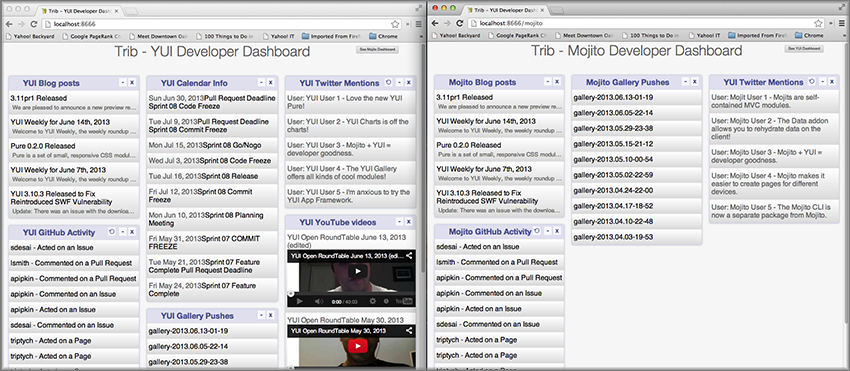

============================================================
8. Advanced Configuration: Contexts, Mojits, and YUI (Draft)
============================================================

Introduction
============

The good news is that your application is basically feature complete for the desktop, but we 
still have some work to do to make it better. In this module, we’re going to learn how to 
use the mojit configuration files defaults.json and definition.json to store data that 
your controller can access. In turn, your controller can pass some of these configuration 
values to the models to get data. We don’t have to hardcode the REST URIs or YQL statements 
in the models anymore, so the models can basically get data from any given source. 

We’ll also look at how to configure YUI in Mojito applications. Mojito comes bundled with 
a version of YUI, but you may want a different version or want something from the gallery 
or configure how Mojito gets YUI. You can also configure logging levels, change the order 
of the logging levels, or provide logging filters. Let’s get started!

Estimated Time
--------------

15 minutes

What We’ll Cover
----------------

- default configurations and definitions
- using the Config addon to get mojit configurations
- yui object and configurations
- configuring the YUI seed
- using the environment:development context
- adding parameters and using regular expressions in the routing configurations

Final Product
-------------

The biggest visible change in the latest version of our application is that it now has
a Mojito dashboard as well as a YUI dashboard. 

Before Starting
---------------

Review of the Last Module
#########################

In the last module, we learned how to bind mojit code (binders) to the DOM and use these 
binders to call controller functions and broadcast/listen to custom events.  Binders can 
respond to user actions by modifying the DOM, calling controllers, getting data from the 
controllers, and refresh or render templates.

- requirements for using binders
- allow event handlers to attach to the mojit DOM node
- communicate with other mojits on the page
- execute actions on the mojit that the binder is attached to
- refreshing templates with binders
- destroying child mojits with binders

Setting Up
##########

``$ cp -r 07_binders 08_adv_config``

Lesson: Advanced Configuration
==============================

Application Configuration
-------------------------

Using YAML
##########

Mojito also supports configuration files in YAML format (JSON is a subset of YAML). 
The YAML file extension could be .yaml or .yml. Mojito allows comments in the YAML files. 
When both the JSON file (e.g., application.json) and the YAML file (e.g., application.yaml) 
are present, the YAML file is used and a warning is issued. For the data types of the YAML 
elements, please see the JSON configuration tables in Application Configuration, Routing, 
and Mojit Configuration.

Our Application Configuration in YAML
*************************************

.. code-block:: javascript

Static Application Name
#######################

.. code-block:: javascript

     "staticHandling": {
          "appName": "trib"
        },

Advanced Routing Configuration
##############################

Adding Parameters
*****************

[{
    "settings": [ "master" ],
    "root": {
        "verbs": ["get"],
        "path": "/",
        "call": "tribframe.index",
        "params": {"view_type": "yui"}
    },
    "mojito_view":{
        "verbs": ["get"],
        "path": "/mojito",
        "call": "tribframe.index",
        "params": {"view_type": "mojito"}
    }

}]

Regular Expressions for Paths
*****************************

Using Parameterized Paths 
*************************

YUI 
###

YUI configuration in Mojito is done with the ``yui.config`` object in ``application.json``. 
For those familiar with YUI, the ``yui.config`` object allows you to configure YUI just as 
you would with the YUI ``config`` Class. Some of the high-level ways to configure YUI would 
include the following:

- select which YUI modules are included in the YUI seed file
- configure the combo handler to use a CDN
- optimize performance for environments that may have latency issues or have limited CPU power
- limit the loading of certain YUI modules for specific languages
- configure logging 
F
or our application, we’re going to focus on configuring the YUI seed and logging. If you 
don’t configure the YUI seed, your application will use the YUI bundled with Mojito. 

Configuring the YUI Seed
************************

To use YUI in Web pages, you include a small JavaScript file called the YUI seed file. The 
YUI seed file allows you to load other YUI components on your page. The seed file is added 
to your Web page by with following ``

From the URL to the seed file, the YUI library can infer the version of the library that 
should be used, the filter that you want to use (min, debug or raw), and the CDN that is 
serving the library.

Seed File in Mojito Applications
^^^^^^^^^^^^^^^^^^^^^^^^^^^^^^^^

As we have said earlier, In Mojito applications, the YUI seed is configured in 
``application.json``. Mojito does this for the following reasons:

- The YUI library is bundled with the application using npm, so loading modules is done 
  differently.
- Mojito applications may run as mobile applications that have connectivity issues 
  preventing access to the YUI seed file.
- When applications are started, new YUI modules, part of the Mojito code, and part of the 
  application code are loaded in the same way as the YUI Core modules, so it is difficult 
  to simply include the YUI seed file in a template.

Default Seed File
^^^^^^^^^^^^^^^^^

In general, you don’t need to worry about the YUI default seed because Mojito creates a 
default configuration for the YUI seed for you. For our application, we want a specific 
version of YUI, so we’ll need to 

Specifying the YUI Build
^^^^^^^^^^^^^^^^^^^^^^^^

.. code-block:: javascript

   [
     {
       "settings": [ "master" ],
       "appPort": "8666",
       "yui":{
         "config": {
           "base": "http://yui.yahooapis.com/3.8.1/build/?",
           "seed": [
             "yui-base",
             "loader-base",
             "loader-yui3",
             "loader-app",
             "loader-app-base{langPath}"
           ]
         }
       },
       "specs": {
         ...
       },
     ...
   ]

Logging
*******

Logging in Mojito is handled by YUI, so as you would expect, you configure logging in the 
``yui`` object. Mojito has six default logging levels, which you can set or modify the 
order of. 

Log Levels
^^^^^^^^^^

The default logging levels are as follows:

- ``debug``
- ``mojito``
- ``info``
- ``warn``
- ``error``
- ``none``

Default Settings
^^^^^^^^^^^^^^^^

The server and client log settings have the following default values:

- ``debug: true`` - turns logging on so that messages are displayed in the console.
- ``logLevel: "debug"`` - log level filter.
- ``logLevelOrder: ['debug', 'mojito', 'info', 'warn', 'error', 'none']`` - the order in 
  which the log levels are evaluated.

Configuring Logging
^^^^^^^^^^^^^^^^^^^

We’ve been just using the default logging up until now, but we’re going to configure the 
logging for production and development and leave the default settings for the master context.

For our production environment, we only want to filter out everything but the

.. code-block:: javascript

   [
     ...
     {
       "settings": [ "environment:production" ],
       "yui": {
         "config": {
           "debug": false,
           "logLevel": "none"
         }
       },
     ...
     },
     ...
   ]

On the other hand, we want to make sure that we see all errors for the development 
environment. We set debug to true and the log level to debug, which will show all possible 
errors.

.. code-block:: javascript

   [
     {
       "settings": [ "environment:production" ],
       "yui": {
         "config": {
           "debug": true,
           "logLevel": "debug"
         }
       },
       ...
     }
   ]

Context Configurations
######################

As we’ve said in past modules, the context is the runtime environment that an application 
is running in. Your application can use the setting property in configuration files to 
define the context and its associated configurations. For instance, as we saw in the 
section on configuring logging, you may want to have different levels of logging for 
production than for the development environment. The runtime environment could be defined 
by the device running the application or the regional environment. You may want to have 
different configurations for the application when it’s running on an iOS device or if your 
application is being viewed in a region where text is read from right to left. We’re going 
to discuss  two types of contexts, how to configure context configurations,and then apply 
them .

Base Context
************

The base context is statically set when you start the application. If you remember the 
`Mojito CLI Basics module <>`_, you’ll recall there was a --context option. This option 
allows you to start an application with a base context. Thus, if you want to run your 
application in the environment:development context, you would use the following 
command: ``$ mojito start --context "environment:production"``

The base context allows you to test your application in different environments. If you 
wanted to see how your application would run on an iPhone and in a region where German 
is spoken, you could start your application with the following base 
context: ``$ mojito start --context “device:iphone,lang:de”``

When your application receives a request, you won’t be able to change the base context, 
so Mojito also has a request context that can be applied based on the context of the 
requestor. Let’s take a look at that next.

Request Context
***************

The request context can be determined by the HTTP headers, such as the ``User-Agent`` for 
the device/OS, or from the query string parameters. Thus, when your application receives 
the HTTP header below, it will look for the context ``“device:android”``:

HTTP header "User-Agent:Mozilla/5.0 (Linux; U; Android 2.3; en-us)”

The same context could be requested with the query string parameter “?device=android”. 
The language, region, and device/OS contexts can often be extracted from the header files, 
but for development and production environments or customized contexts, you may want to 
need to use the query string parameters to request a context.

Mojits
------

We’ve already looked at the configuration files application.json and routes.json to 
create mojit instances and define routing paths, but Mojito also has configuration files 
that mojits can use to store key-value pairs and defaults. 

Default Configurations
######################

As you know, the mojit instance definitions can store configurations in the config object. 
For example, you may want a mojit instance to have specific configuration information, but 
you may want to define default configurations as well. You define mojit defaults in the 
``defaults.json`` file.  In the example application.json, the twitter instance defines 
the title:

.. code-block:: javascript

   ...
     "twitter": {
       "type":"twitterMojit"
       "config": {
         "title": "Twitter Feed"
       }
     },
   ...

We can define the default URL or search query in the defaults.json file of the 
``twitterMojit``. Because the twitter mojit instance does not define the url and query 
properties explicitly defined, your application will use the defaults.

.. code-block:: javascript

   [
     {
       "settings": [ "master" ],
       "config": {
          "url" : “http://search.twitter.com/search.json”,
          "query": "YUI"
       }
     }
   ]

Definitions
***********

The ``definitions.json`` file allows your mojit to store and access configurations as well. 
The key-value pairs in ``definitions.json`` has nothing to do with the mojit definition. 

For instance, suppose you want to store the possible feed URLs for YouTube videos. In a 
``youtubeMojit``, you may want to display different streams of videos for Mojito or YUI. 
You could have a default or specify one in the config object of the ``youtube`` mojit 
instance, but a better solution may be to have configurations defined in your 
``definitions.json``.

In the ``definitions.json`` of the ``youtubeMojit`` below has a series of possible feeds.

[
  {
    “settings": [ "master" ],
    “yui”: { 
      “feed_name”: “YUI”,     
      “url”:“https://gdata.youtube.com/feeds/base/users/yuilibrary/uploads”,
    },
    “mojito”: {
      “feed_name”: “Mojito”,
      “url”: “...”
  }
]

Creating the Application
========================

#. After you have copied the application that you made in the last module (see Setting Up), 
  change into the application ``08_adv_config``.
#. 

Troubleshooting
===============

Problem One
-----------
Nulla pharetra aliquam neque sed tincidunt. Donec nisi eros, sagittis vitae lobortis nec, 
interdum sed ipsum. Quisque congue tempor odio, a volutpat eros hendrerit nec. 

Problem Two
-----------

Nulla pharetra aliquam neque sed tincidunt. Donec nisi eros, sagittis vitae lobortis nec, 
interdum sed ipsum. Quisque congue tempor odio, a volutpat eros hendrerit nec. 

Summary
=======

Q&A
===

Test Yourself
=============

- How do you access models from a controller?
- What are the four arguments passed to the methods of the REST module?
- What is the recommended way for getting data in Mojito applications?

Terms
=====

Source Code
===========

[app_part{x}](http://github.com/yahoo/mojito/examples/quickstart_guide/app_part{x})

Further Reading
===============

- [Mojito Doc](http://developer.yahoo.com/cocktails/mojito/docs/)
- 

