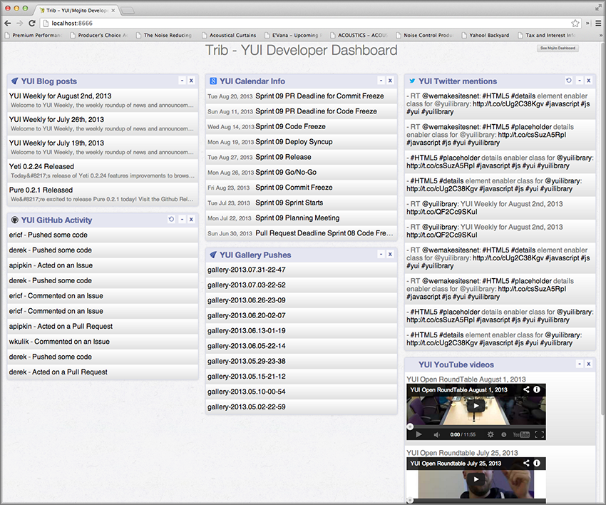

============
Introduction
============

You will be creating a dashboard application that reports 
GitHub activity and displays blog posts and displays tweets about Mojito and YUI. 
We will be building our application in stages, so that you will start from the 
most basic Mojito application and then add new features. 

The screenshot below is of the final dashboard application that you will 
be building. The application has a separate dashboard for YUI and Mojito information,
such as GitHub statistics, Twitter feeds, YouTube videos, etc. 

.. _dashboard_intro-who:

Who Should Use This Tutorial?
=============================

Anyone interested in developing Web applications for the desktop and mobile 
devices will benefit from using Mojito. Those developers who have used 
the YUI library and Node.js will have an easier time learning how to use Mojito.

.. _dashboard_intro-what:

What We Want You to Learn
=========================

During each module, we want to emphasize a specific topic and create an 
application, so that you learn something that you can build on and have 
yet another application under your belt. More importantly though, we want 
to show you how to develop Web applications with Mojito, and when 
you’re finished, you should feel confident enough to use Mojito to 
add features to your own Web application.

.. _dashboard_intro-about_tut:

About the Tutorial
==================

You’ll be creating a standalone application for each module, which we 
will be displayed in a screenshot in the introduction. The application 
that you create in a modules will be used as the starting point for the 
proceeding module. The idea is to build a complex and full-featured 
application in stages, so that you not only learn the focus of the module 
that you are working on, but also are learning how to develop with Mojito. 
Starting from where we left off will allow you to save time and your prior 
efforts, but there will be times when we need to move or modify code from 
the past module. This is intentional and part of the education for learning 
how to use Mojito.

.. _dashboard_intro-how:

How the Tutorial is Structured
==============================

The structure of modules, in general, will include the follow sections:

- **Intro:** describes what you’ll be learning, gives a time estimate, lists prerequisites, 
  shows you where to find source code, and provides a screenshot of the final application for the module
- **Lesson:** explains an important concept that the example is focused around.
- **Creating the Application:** here is where you create your application and then run it. 
- **Summary:**  we recap what you’ve learned and the main takeaway points.
- **Troubleshooting (Optional):** we provide tips for debugging common problems associated with the topic of the module.
- **Q&A (optional):** we provide answers to commonly asked questions.
- **Test Yourself (Optional):** we offer simple exercises to expand on what you’ve learned.
- **Further Reading:** lists links to documentation, articles, blog posts, etc., to further your learning.

.. _dashboard_intro-about_app:

About the Application
=====================

The dashboard application that you will be developing is intended to help 
developers of YUI and Mojito by presenting information about the project(s) 
and provide tools and information to YUI and Mojito developers on a day-to-day 
basis, as well as online documentation, news, and resources.

For more advanced users, they can view the final dashboard application as a 
reference application showcasing many of Mojito’s features. They’ll also be 
able to learn how to best use YUI and YUI CSS in a Mojito application and 
the best practices for writing code for Mojito applications.

.. _dashboard_app-tech:

Technology Used in Application
------------------------------

Besides Mojito, your dashboard application also relies on the following technologies:
- Node.js
- YUI CSS (with normalize)
- YUI
- YQL
- Handlebars
- npm

.. _dashboard_app-design:

Application Design
------------------

The Dashboard application is a Web-based application that utilizes Mojito to access 
YQL data sources for various information about the YUI and Mojito projects. Mojito 
is the application layer that handles accessing the YQL data and generates the HTML 
which is sent to the client. Presentation is handled via HTML using the Handlebars 
template engine in Mojito. Look and feel is handled by YUI CSS including responsive grids. 
We'll also have separate templates for the iPhone and iPad to customize the the layout
of the page.

.. _dashboard_intro-before:

Before Starting
===============

You’ll need to install Node.js, npm, and Mojito for this tutorial, so go ahead and 
complete the `Mojito Quickstart <../getting_started/quickstart.html>`_. The quickstart will 
also show you how run simple Mojito commands to create and run a simple application.

.. _dashboard_intro-reqs:

Requirements
============

.. _dashboard_reqs-system:

System
------

OS X  or Linux-based machine

.. _dashboard_reqs-software:

Software
--------

`Git <http://git-scm.com/>`_

.. _dashboard_intro-recommended:

Recommended 
===========

.. _dashboard_intro-recommended:

Software
--------

- ``nodemon`` - This package is basically a monitoring script that will allow you 
  to start Mojito applications, make changes, and see the changes reflected immediately. 

.. _dashboard_intro-reading:

Reading
=======

.. _dashboard_reading-node:

New to Node.js?
---------------

Because Mojito runs in the Node.js environment on the server, we recommend that 
if you do not have experience using Node.js or npm, go through the Node.js documentation 
and How to Node. Understanding the Node.js module system, why not to write blocking code, 
being familiar with the API and utilities, will all help you develop and debug Mojito 
applications. You’ll also learn how to use npm modules and Node.js core modules to do 
work for your applications. 

.. _dashboard_reading-yui:

Haven’t Tried YUI?
------------------

Mojito runs in the Node.js environment, but it’s built with YUI. Understanding YUI will 
help you understand the Mojito source code and write applications. You can also easily 
use or write YUI modules that can be used in your application code. You don’t need to know 
YUI to use Mojito, but just being familiar with YUI will give you a great advantage in 
developing Mojito applications. 

.. _dashboard_intro-what:

What’s Covered?
===============

The tutorial is divided into the following 12 (15?) self-contained modules, each covering 
an critical topic for development. 

#. Mojito CLI Basics
#. Mojits: Powering Your App
#. Composite Mojits
#. Frame Mojits
#. Getting Data
#. Testing in Mojito
#. Mojito on the Client
#. Advanced Configuration: Contexts, Routing, and YUI
#. Handlebars, Templates, and Custom Views
#. Localizing Your Application

.. _dashboard_intro-src:

Where to Find Source Code?
==========================

For each module of this tutorial, you can find the source code in 
the `examples/dashboard <https://github.com/yahoo/mojito/tree/develop/examples/dashboard/>`_
directory of the Mojito GitHub repository. If you find issues or would like to 
improve the applications, feel free to make a pull request. 

.. _dashboard_intro-conventions:

Conventions Used in This Tutorial
=================================

.. _dashboard_conventions-naming:

Naming Conventions
------------------

To help you remember what you learned in each module, we’re going to use 
the following naming convention: 

Application names: {mod_num}_mod_name
Mojit names: {mojit_name}

.. _dashboard_conventions-code:

Code/Commands 
-------------

Commands, variables, directories, and files appear in monospaced font.
Commands that you are supposed to type and GUI elements appear in boldface type.
Ellipses in code snippets indicate that the displayed code is only part of the whole:
       
.. code-block:: javascript
 
   ...
     index: function(ac) {
       ...
       ac.done({data: data});
     }
   ...

