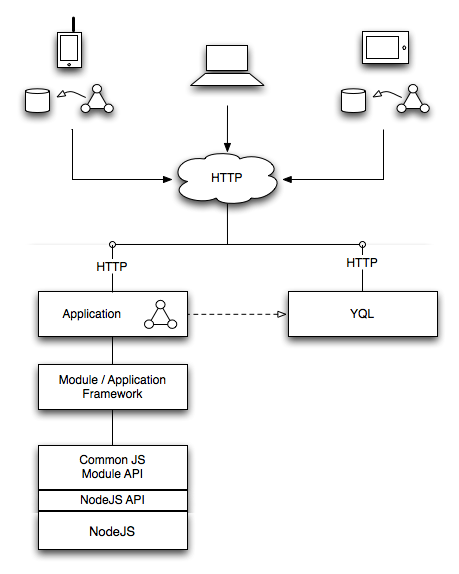
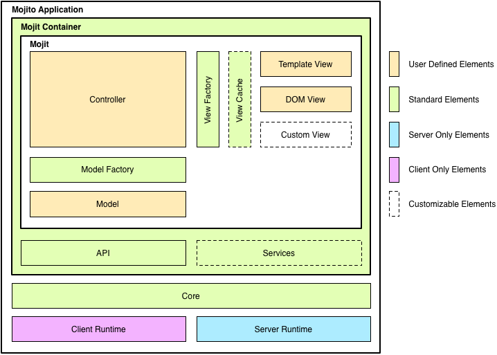

===================
Mojito Architecture
===================

This chapter first takes at the bird's eye view of the Mojito framework and then  
offers a brief explanation of the key points.. Understanding the architecture and the components 
of the Mojito framework will give you insight about how your application interacts 
with the framework.

.. _mj_arch-overview:

Overview
--------

The diagram below illustrates how Mojito runs on different clients and gets data. 
See the sections that follow for further explanation about clients, Mojito applications, and data.

.. _overview-clients:

Clients and Runtimes
####################

                
- **Mobile browser:** Such clients support an HTML-based online experience, and may also 
- support an HTML5-based offline experience.
- **Desktop browser: Such clients are assumed to be always connected, and support an 
  HTML-based online experience.
- **Native client:** Such clients are deployed as packaged applications, wrapping native 
  chrome around an HTML5-based experience.
  
.. _overview-apps:  

Mojito Applications
###################

In short, an application is a set of module/widget configurations together with a configuration 
for the application itself. It is a packaged entity that may be distributed and deployed as a unit, 
and as such, it is deployment-independent. The modules/widgets used by an application may be 
included directly within the package or may be included by reference from a cloud-based repository.

See also `Mojito Applications <./mojito_apps.html>`_ for a more in-depth discussions.

.. _overview-data:

Data
####

Data is typically obtained with YQL. In most cases, the data will be requested by the application 
and processed in some way before it is transferred to the client. Native applications, however, 
may make data requests directly to YQL. JSON is expected to be by far the most prevalent format 
for data retrieved from YQL.

.. _mj_arch-framework:

Mojito Framework
----------------

This diagram shows the relationship among the Mojito application, the 
Mojito core, mojits, and the runtime environments. The subsequent sections describe the 
elements in the diagram in more detail.

   and runtime environments.
   :height: 513px
   :width: 718px
   :align: left

.. _framework-server_runtime:

Mojito Server Runtime
#####################

The base server-only capabilities that support the Mojito Core includes, but are not 
limited to, the following:

- HTTP Server
- Routing Rules
- Config Loader
- Disk-Based Loader

.. _framework-client_runtime:

Mojito Client Runtime
#####################

The base client-only capabilities that support the Mojito Core include, but are not limited 
to, the following:

- URL-Based/JSON-based Loader
- Local Storage / Cache Access

.. _framework-core:

Mojito Core
###########

The core common functionality of Mojito runs on both server and client. The core is initialized 
(or bootstrapped, if you will) by either the Mojito Server Runtime or the Mojito Client Runtime, as 
appropriate. Elements of the Mojito Core include, but are not limited to, the following:

- Front Controller
- Dispatcher
- Mojit Registry

.. _framework-mojit_container:

Mojit Container
###############

The Mojit Container is where mojit instances live. This is analogous, in a traditional Java Web 
framework, to the servlet container, but runs in both server and client contexts. It includes, but 
is not limited to, the following:

- Mojit Lifecycle

.. _framework-mojit_container:

ActionContext Object
#####################

The ``ActionContext`` object is available to a mojit instance to enable it to do its work. 
Each mojit instance receives a unique instance of this object. In a traditional Web framework, this 
is analogous to the request context (except, of course, that there is no request object when the 
mojit is running within the client).

.. _framework-mojito_services:

Mojito Services
###############

TBD

.. Need a short description here.

.. _framework-model_factory:

Model Factory
#############

The Model Factory creates the model instance for a mojit instance based on that mojit's 
configuration (and perhaps on its corresponding mojit definition). The use of a factory mechanism 
allows the framework to easily interject proxies and other intermediaries, in a manner that is 
transparent to the mojit developer. In addition, a mojit developer may choose to provide a custom 
factory, although the need for this is not expected other than in rare circumstances.

.. _framework-view_factory:

View Factory
############

Similarly to the Model Factory, the View Factory creates the view instance for a mojit instance
based on a mojit's configuration and on its corresponding mojit definition. 

The following standard view types are provided, along with the capability for a mojit developer 
to define a custom view type:

- Template View
- DOM View
- Hybrid View

.. _framework-view_cache:

View Cache
##########

The View Cache provides applications with the ability to cache. For example, because of the View
Cache, an application can cache partially rendered views to improve performance in situations 
where the same partial rendering is frequently requested.

.. _mj_arch-framework_components:

Mojito Framework Components
---------------------------

Box A in the flowchart below represents the Application Container at its most basic level. Here 
we focus on the servicing of page requests and user interactions, and ignore for the 
moment issues such as packaging and deployment. Again, we examine more closely 
the framework components in the following sections.

.. figure::
   :scale: 75 %
   :alt: Flowchart showing how page requests are handled and responses returned.
   :height: 540px
   :width: 457px
   :align: left

.. _framework_components-dispatcher:

Dispatcher/Mapper
#################

This component processes incoming URLs and determines how to map these 
to the appropriate application functionality. This is similar in many ways to the front controller 
used in most action frameworks. The target functionality is almost always provided by a mojit, 
and thus, the Dispatcher primarily maps URLs to mojit identifiers.

.. _framework_components-nav_manager:

Navigation Manager
##################

In some applications, it is important that certain *destinations* within 
the application be URL addressable (e.g., to allow the user to create bookmarks to specific points 
or states within the application). This is most easily managed through a central Navigation 
Manager that both assists the Dispatcher in resolving URLs and provides URL management facilities 
to application functionality. Note that many sites and simpler applications have no need of 
URL management, so this component may not be used in such cases.

.. _framework_components-mojit_host:

Mojit Host
##########

The mojits themselves are not part of the Application Container per se. However, 
the container provides the facilities to host, support, and manage mojits while the mojits 
collectively provide the functionality of the application. See `Mojits <mojito_apps.html#mojits>`_ 
for more information about mojits.

.. _framework_components-app_config:

Application Configuration
#########################

A particular instance of the Application Container is initialized 
through an externally managed configuration. This configuration includes, among other things, 
the mappings that drive the Dispatcher, the identification of necessary mojit registries, and 
other environmental parameters. (Note that the Application Configuration specifically excludes 
deployment parameters; this is because the Application Configuration is part of the packaged, 
deployable application, and thus, must not be tied to a particular deployment environment.)

